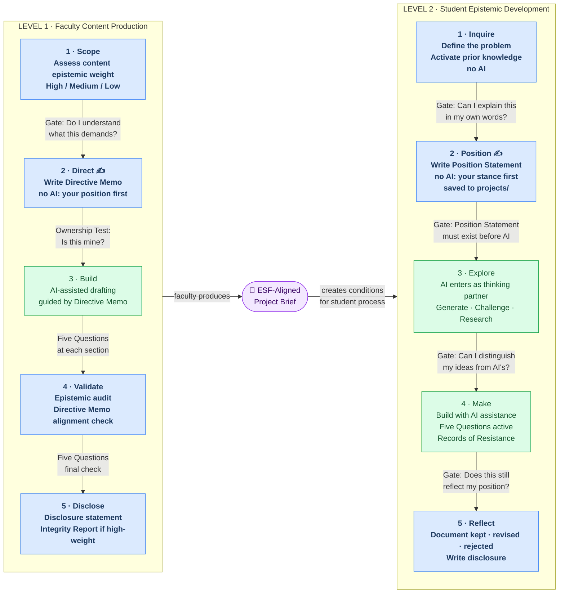
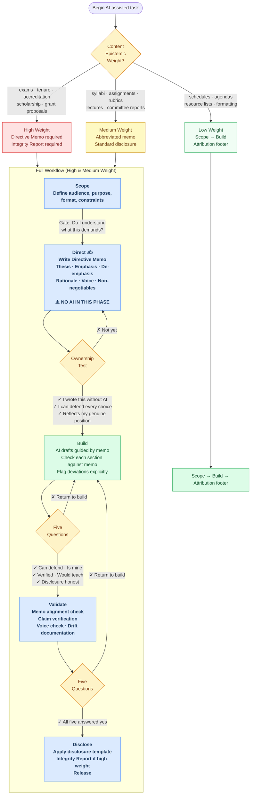
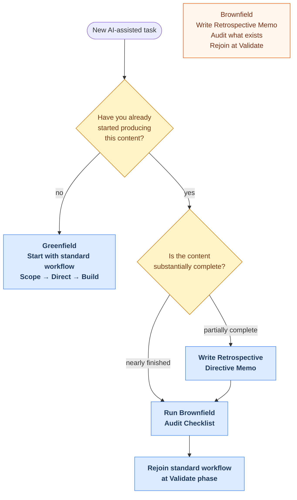

# ESF Workflow Diagrams

Two levels, one framework. Faculty use Level 1 to produce course materials with intellectual integrity. Students use Level 2 to develop epistemic agency through those materials. The project brief is the bridge.

---

## Full Architecture: Both Levels

```mermaid
flowchart LR
    classDef humanOnly fill:#dbeafe,stroke:#3b82f6,color:#1e3a5f,font-weight:bold
    classDef aiAssisted fill:#dcfce7,stroke:#16a34a,color:#14532d
    classDef artifact fill:#f3e8ff,stroke:#9333ea,color:#3b0764
    classDef note fill:#f8fafc,stroke:#cbd5e1,color:#475569,font-style:italic

    subgraph L1["  LEVEL 1 · Faculty Content Production  "]
        direction TB
        s1["1 · Scope\nAssess content epistemic weight\nHigh / Medium / Low"]:::humanOnly
        s2["2 · Direct ✍️\nWrite Directive Memo\nno AI: your position first"]:::humanOnly
        s3["3 · Build\nAI-assisted drafting\nguided by Directive Memo"]:::aiAssisted
        s4["4 · Validate\nEpistemic audit\nDirective Memo alignment check"]:::humanOnly
        s5["5 · Disclose\nDisclosure statement\nIntegrity Report if high-weight"]:::humanOnly

        s1 -->|"Gate: Do I understand\nwhat this demands?"| s2
        s2 -->|"Ownership Test:\nIs this mine?"| s3
        s3 -->|"Five Questions\nat each section"| s4
        s4 -->|"Five Questions\nfinal check"| s5
    end

    BRIEF(["📄 ESF-Aligned\nProject Brief"]):::artifact

    subgraph L2["  LEVEL 2 · Student Epistemic Development  "]
        direction TB
        t1["1 · Inquire\nDefine the problem\nActivate prior knowledge\nno AI"]:::humanOnly
        t2["2 · Position ✍️\nWrite Position Statement\nno AI: your stance first\nsaved to projects/"]:::humanOnly
        t3["3 · Explore\nAI enters as thinking partner\nGenerate · Challenge · Research"]:::aiAssisted
        t4["4 · Make\nBuild with AI assistance\nFive Questions active\nRecords of Resistance"]:::aiAssisted
        t5["5 · Reflect\nDocument kept · revised · rejected\nWrite disclosure"]:::humanOnly

        t1 -->|"Gate: Can I explain this\nin my own words?"| t2
        t2 -->|"Gate: Position Statement\nmust exist before AI"| t3
        t3 -->|"Gate: Can I distinguish\nmy ideas from AI's?"| t4
        t4 -->|"Gate: Does this still\nreflect my position?"| t5
    end

    L1 -->|"faculty produces"| BRIEF
    BRIEF -->|"creates conditions\nfor student process"| L2
```

---

## Level 1 Detail: Faculty Workflow

```mermaid
flowchart TD
    classDef humanOnly fill:#dbeafe,stroke:#3b82f6,color:#1e3a5f,font-weight:bold
    classDef aiAssisted fill:#dcfce7,stroke:#16a34a,color:#14532d
    classDef gate fill:#fef3c7,stroke:#d97706,color:#78350f
    classDef artifact fill:#f3e8ff,stroke:#9333ea,color:#3b0764
    classDef high fill:#fee2e2,stroke:#dc2626,color:#7f1d1d
    classDef med fill:#fef9c3,stroke:#ca8a04,color:#713f12
    classDef low fill:#f0fdf4,stroke:#16a34a,color:#14532d

    START(["Begin AI-assisted task"])

    WEIGHT{"Content\nEpistemic\nWeight?"}:::gate

    HIGH["High Weight\nDirective Memo required\nIntegrity Report required"]:::high
    MED["Medium Weight\nAbbreviated memo\nStandard disclosure"]:::med
    LOW["Low Weight\nScope → Build\nAttribution footer"]:::low

    START --> WEIGHT
    WEIGHT -->|"exams · tenure · accreditation\nscholarship · grant proposals"| HIGH
    WEIGHT -->|"syllabi · assignments · rubrics\nlectures · committee reports"| MED
    WEIGHT -->|"schedules · agendas\nresource lists · formatting"| LOW

    subgraph FULL["Full Workflow (High & Medium Weight)"]
        direction TB
        S1["Scope\nDefine audience, purpose,\nformat, constraints"]:::humanOnly
        S2["Direct ✍️\nWrite Directive Memo\nThesis · Emphasis · De-emphasis\nRationale · Voice · Non-negotiables\n\n⚠️ NO AI IN THIS PHASE"]:::humanOnly
        S3["Build\nAI drafts guided by memo\nCheck each section against memo\nFlag deviations explicitly"]:::aiAssisted
        S4["Validate\nMemo alignment check\nClaim verification\nVoice check · Drift documentation"]:::humanOnly
        S5["Disclose\nApply disclosure template\nIntegrity Report if high-weight\nRelease"]:::humanOnly

        OT{"Ownership\nTest"}:::gate
        FQ1{"Five\nQuestions"}:::gate
        FQ2{"Five\nQuestions"}:::gate

        S1 -->|"Gate: Do I understand\nwhat this demands?"| S2
        S2 --> OT
        OT -->|"✓ I wrote this without AI\n✓ I can defend every choice\n✓ Reflects my genuine position"| S3
        OT -->|"✗ Not yet"| S2
        S3 --> FQ1
        FQ1 -->|"✓ Can defend · Is mine\n✓ Verified · Would teach\n✓ Disclosure honest"| S4
        FQ1 -->|"✗ Return to build"| S3
        S4 --> FQ2
        FQ2 -->|"✓ All five answered yes"| S5
        FQ2 -->|"✗ Return to build"| S3
    end

    HIGH --> FULL
    MED --> FULL

    ABBREV["Scope → Build → Attribution footer"]:::aiAssisted
    LOW --> ABBREV
```

---

## Level 2 Detail: Student Workflow

```mermaid
flowchart TD
    classDef humanOnly fill:#dbeafe,stroke:#3b82f6,color:#1e3a5f,font-weight:bold
    classDef aiAssisted fill:#dcfce7,stroke:#16a34a,color:#14532d
    classDef gate fill:#fef3c7,stroke:#d97706,color:#78350f
    classDef artifact fill:#f3e8ff,stroke:#9333ea,color:#3b0764
    classDef blocked fill:#fee2e2,stroke:#dc2626,color:#7f1d1d

    BRIEF(["📄 Project Brief\nfrom instructor"]):::artifact

    subgraph HUMANONLY["  Human Only: complete before opening any AI tool  "]
        P1["1 · Inquire\nWhat is this asking?\nWhat do I already know?\nWhat assumptions am I making?"]:::humanOnly
        P2["2 · Position ✍️\nWrite Position Statement\n• What is my position?\n• What matters most?\n• What is non-negotiable?\n\nSave to projects/position-statements/"]:::humanOnly
    end

    GATE{"Position Statement\nexists?"}:::gate
    BLOCKED["⛔ Cannot proceed\n\nWrite your Position Statement first.\nThis is not a rule; it is the mechanism\nthat keeps your thinking yours."]:::blocked

    subgraph AIASSISTED["  AI-Assisted: with Position Statement as anchor  "]
        P3["3 · Explore\nAI enters as thinking partner\nGenerate options\nChallenge assumptions\nPressure-test your position"]:::aiAssisted
        P4["4 · Make\nBuild the work product\nCheck each section against\nyour Position Statement\n\nFive Questions active\nRecord of Resistance: document\nwhat you kept · revised · rejected"]:::aiAssisted
    end

    P5["5 · Reflect\nCompare final work to Position Statement\nDocument what changed and why\nWrite honest disclosure"]:::humanOnly

    FQ["The Five Questions\n1. Can I defend this?\n2. Is this mine?\n3. Did I verify?\n4. Would I teach this?\n5. Is my disclosure honest?"]:::artifact

    BRIEF --> P1
    P1 -->|"Gate: Can I explain this\nin my own words?"| P2
    P2 --> GATE
    GATE -->|"yes, file exists\nin projects/"| P3
    GATE -->|"no"| BLOCKED
    BLOCKED -.->|"write it first,\nthen return"| P2
    P3 -->|"Gate: Can I distinguish\nmy ideas from AI's?"| P4
    P4 -->|"Gate: Does this still\nreflect my position?"| P5
    P5 -.-> FQ
```

---

## Starting Mid-Project: The Brownfield Pathway

Not every project begins with ESF. You may encounter this framework after you have already started drafting a syllabus, writing an assignment, or producing course materials with AI assistance. The brownfield pathway lets you adopt ESF practices without discarding work in progress.

Brownfield adoption is not lesser. It is how most practitioners encounter a new framework. The goal is honest assessment of where you are, not performative compliance with a process you did not have when you started.

### When to Use This

- You have already produced content with AI but without a Directive Memo
- You want to apply ESF going forward but your current deliverable is partially complete
- You are revising existing materials and want to layer in ESF practices

### Decision: Brownfield or Greenfield?

```mermaid
flowchart TD
    classDef humanOnly fill:#dbeafe,stroke:#3b82f6,color:#1e3a5f,font-weight:bold
    classDef gate fill:#fef3c7,stroke:#d97706,color:#78350f
    classDef brownfield fill:#fff7ed,stroke:#ea580c,color:#7c2d12

    START(["New AI-assisted task"])
    Q1{"Have you already\nstarted producing\nthis content?"}:::gate

    GREEN["Greenfield\nStart with standard workflow\nScope → Direct → Build"]:::humanOnly
    BROWN["Brownfield\nWrite Retrospective Memo\nAudit what exists\nRejoin at Validate"]:::brownfield

    Q2{"Is the content\nsubstantially complete?"}:::gate
    RETRO["Write Retrospective\nDirective Memo"]:::humanOnly
    AUDIT["Run Brownfield\nAudit Checklist"]:::humanOnly
    REJOIN["Rejoin standard workflow\nat Validate phase"]:::humanOnly

    START --> Q1
    Q1 -->|"no"| GREEN
    Q1 -->|"yes"| Q2
    Q2 -->|"partially complete"| RETRO
    Q2 -->|"nearly finished"| AUDIT
    RETRO --> AUDIT
    AUDIT --> REJOIN
```

### The Retrospective Directive Memo

A standard Directive Memo establishes intent before production. A Retrospective Directive Memo excavates intent from work you have already done. This is harder, not easier. You must distinguish between decisions you made deliberately and decisions that emerged from AI's framing.

Write a Retrospective Directive Memo that answers:

1. **Thesis (excavated):** What is this content actually arguing or teaching? Not what you planned. What did you build?
2. **Emphasis (confirmed):** What ended up mattering most? Was that your intent, or did it drift there?
3. **De-emphasis (identified):** What did you set aside? Was that a deliberate choice, or did AI's suggestions quietly redirect you?
4. **Voice check:** Does this sound like you, or does it sound like AI-generated academic prose you accepted because it was serviceable?
5. **Non-negotiables (declared):** What must stay exactly as it is? What are you willing to revise now that you are looking at it with fresh eyes?

The Ownership Test still applies: Can you defend every choice? If you find sections where the honest answer is "I accepted what AI gave me because it sounded fine," that is the section that needs revision.

### Brownfield Audit Checklist

For each section of your in-progress work, assess what you can layer in now.

**Layer in immediately:**
- [ ] Assess Content Epistemic Weight for the overall deliverable
- [ ] Write the Retrospective Directive Memo (above)
- [ ] Run the Five Questions against each completed section
- [ ] Add a disclosure statement to the deliverable
- [ ] For remaining sections, use the standard Build phase (memo-guided drafting)

**Layer in on next revision:**
- [ ] Rewrite sections where the Five Questions revealed weak ownership
- [ ] Align voice and framing to your Retrospective Directive Memo
- [ ] Generate an Integrity Report if the content is high-weight

**Accept for this iteration:**
- [ ] Sections completed before ESF adoption that pass the Five Questions can stand as-is
- [ ] You do not need to re-draft content that genuinely reflects your intent, even if it was produced without a prospective memo

### Worked Example: Brownfield Adoption

Dr. Reyes has been building her Digital Illustration syllabus for three weeks using AI assistance. She has a complete weekly schedule, five assignment briefs, and a grading rubric. She encounters ESF at a faculty workshop and wants to adopt it without starting over.

**Step 1: Retrospective Directive Memo.** She reviews her syllabus and writes:

> **Thesis:** This course teaches illustration students to use AI generation tools as part of a professional digital workflow, not as a replacement for drawing skill.
>
> **Emphasis:** Editorial judgment. Students must be able to explain why they kept, revised, or rejected AI output in every assignment.
>
> **De-emphasis:** Technical AI knowledge. Students do not need to understand model architectures. They need to direct models effectively.
>
> **Voice check:** The assignment briefs sound like me. The weekly schedule descriptions sound generic. I accepted AI's phrasing for most of those without revision.
>
> **Non-negotiables:** The portfolio requirement stays. The "draw first, generate second" rule in every project stays.

**Step 2: Brownfield Audit.** She runs through the checklist:

- Content Epistemic Weight: **Medium** (syllabus for active course, not accreditation)
- Five Questions on assignment briefs: All five pass. She wrote clear creative constraints and can defend every requirement.
- Five Questions on weekly schedule: Questions 1 and 2 flag problems. She cannot defend the Session 9 description because she does not remember writing it. She accepted AI's version.
- Disclosure: Not yet present. She drafts one.

**Step 3: Targeted revision.** She rewrites the weekly schedule descriptions she cannot defend (Sessions 9, 12, and 15). She leaves the assignment briefs untouched because they pass the Five Questions. She adds a disclosure statement.

**Step 4: Forward commitment.** For the remaining three assignment briefs she has not yet written, she uses the standard ESF workflow: her Retrospective Directive Memo now serves as the prospective memo for new content.

**Total time added:** approximately 90 minutes. She did not rebuild her syllabus. She identified the 15% that needed attention and addressed it.

### Forward Commitment

Once you complete the brownfield audit, use the standard workflow for all new content on this deliverable and future deliverables. The Retrospective Directive Memo becomes your anchor for revisions. When you next update this content, you have a memo to check against.

The brownfield pathway is an on-ramp, not a permanent alternative. It gets you into the framework. The standard workflow keeps you there.

---

## The Five Questions

Applied at every human gate in both levels.

| # | Question | Tests For |
|---|----------|-----------|
| 1 | **Can I defend this?** | Genuine understanding vs. surface familiarity |
| 2 | **Is this mine?** | Did I direct this, or accept AI's framing? (design authority test) |
| 3 | **Did I verify?** | Independent confirmation vs. assumed accuracy |
| 4 | **Would I teach this?** | Deep endorsement vs. shallow approval |
| 5 | **Is my disclosure honest?** | Transparent accountability vs. performative compliance |

If any answer is **no**, revise, reduce AI contribution, or disclose accurately. The third option is not a failure. It is intellectual honesty.

---

## Student Posture: Art Director and Orchestrator

For technical and creative computing projects, the Level 2 process has two complementary postures.

**Art Director** describes the creative authority relationship: the student defines the vision, sets the aesthetic and conceptual direction, and evaluates all AI output against that vision. AI is the creative material, not the decision-maker.

**Orchestrator** describes the technical coordination relationship: the student decides what each AI capability does, how components communicate, and what the whole system means. AI is the engineering team. The student decides the architecture.

Students in the BUILD course use both. Students in the DESIGN course formalize the orchestrator role as the core of agentic design. Naming both postures in the THINK and BUILD courses prepares students for that transition.

## Working Across Sessions

For projects that span multiple AI sessions, students should briefly re-establish their Position Statement and key decisions at the start of each session. This is not repetitive; it is how the student retains ownership of the project's memory.

What the student chooses to re-establish tells them what the highest-weight decisions are: the ones only they can hold. This is a practical application of Content Epistemic Weight at the student level.

**A process blog prompt that works well here:** "What did you need to re-establish with AI at the start of this session, and what does that tell you about who is holding the project's creative memory?"

---

## Artifact Storage Reference

The toolkit saves three types of process artifacts to named paths so they persist across sessions and serve as an audit trail.

| Artifact | When Required | Course Documents Path | General Documents Path |
|----------|--------------|----------------------|----------------------|
| **Directive Memo** | Before Build phase (high and medium weight) | `courses/[course]/directive-memos/[task]-memo.md` | `documents/directive-memos/[task]-memo.md` |
| **Integrity Report** | After Validate phase (high weight) | `courses/[course]/integrity-reports/[task]-integrity-report.md` | `documents/integrity-reports/[task]-integrity-report.md` |
| **Gate Verification Record** | After Validate phase (medium weight) | `courses/[course]/gate-records/[task]-gate-record.md` | `documents/gate-records/[task]-gate-record.md` |

**Naming convention:** `[task]` is a short, descriptive slug for the work (e.g., `syllabus-revision`, `midterm-rubric`, `accreditation-narrative`).

**Low-weight content** does not generate artifacts beyond the deliverable itself and an attribution footer.

---

## Content Epistemic Weight at a Glance

| Weight | Requires | Faculty Examples | Student Examples |
|--------|----------|-----------------|-----------------|
| **High** | Full workflow · Directive Memo · Integrity Report | Exams, tenure materials, accreditation reports, scholarship | Final portfolio, capstone, thesis |
| **Medium** | Standard workflow · abbreviated memo · disclosure | Syllabi, assignments, rubrics, committee reports | Major projects, research papers |
| **Low** | Scope → Build → attribution | Schedules, agendas, resource lists | Quick responses, drafts for review |
