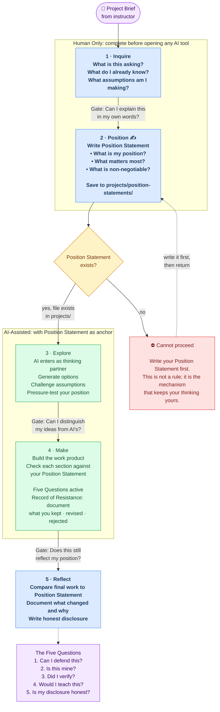

# ESF Workflow Diagrams

Two levels, one framework. Faculty use Level 1 to produce course materials with intellectual integrity. Students use Level 2 to develop epistemic agency through those materials. The project brief is the bridge.

---

## Full Architecture: Both Levels

```mermaid
flowchart LR
    classDef humanOnly fill:#dbeafe,stroke:#3b82f6,color:#1e3a5f,font-weight:bold
    classDef aiAssisted fill:#dcfce7,stroke:#16a34a,color:#14532d
    classDef artifact fill:#f3e8ff,stroke:#9333ea,color:#3b0764
    classDef note fill:#f8fafc,stroke:#cbd5e1,color:#475569,font-style:italic

    subgraph L1["  LEVEL 1 · Faculty Content Production  "]
        direction TB
        s1["1 · Scope\nAssess content epistemic weight\nHigh / Medium / Low"]:::humanOnly
        s2["2 · Direct ✍️\nWrite Directive Memo\nno AI: your position first"]:::humanOnly
        s3["3 · Build\nAI-assisted drafting\nguided by Directive Memo"]:::aiAssisted
        s4["4 · Validate\nEpistemic audit\nDirective Memo alignment check"]:::humanOnly
        s5["5 · Disclose\nDisclosure statement\nIntegrity Report if high-weight"]:::humanOnly

        s1 -->|"Gate: Do I understand\nwhat this demands?"| s2
        s2 -->|"Ownership Test:\nIs this mine?"| s3
        s3 -->|"Five Questions\nat each section"| s4
        s4 -->|"Five Questions\nfinal check"| s5
    end

    BRIEF(["📄 ESF-Aligned\nProject Brief"]):::artifact

    subgraph L2["  LEVEL 2 · Student Epistemic Development  "]
        direction TB
        t1["1 · Inquire\nDefine the problem\nActivate prior knowledge\nno AI"]:::humanOnly
        t2["2 · Position ✍️\nWrite Position Statement\nno AI: your stance first\nsaved to projects/"]:::humanOnly
        t3["3 · Explore\nAI enters as thinking partner\nGenerate · Challenge · Research"]:::aiAssisted
        t4["4 · Make\nBuild with AI assistance\nFive Questions active\nRecords of Resistance"]:::aiAssisted
        t5["5 · Reflect\nDocument kept · revised · rejected\nWrite disclosure"]:::humanOnly

        t1 -->|"Gate: Can I explain this\nin my own words?"| t2
        t2 -->|"Gate: Position Statement\nmust exist before AI"| t3
        t3 -->|"Gate: Can I distinguish\nmy ideas from AI's?"| t4
        t4 -->|"Gate: Does this still\nreflect my position?"| t5
    end

    L1 -->|"faculty produces"| BRIEF
    BRIEF -->|"creates conditions\nfor student process"| L2
```

---

## Level 1 Detail: Faculty Workflow

```mermaid
flowchart TD
    classDef humanOnly fill:#dbeafe,stroke:#3b82f6,color:#1e3a5f,font-weight:bold
    classDef aiAssisted fill:#dcfce7,stroke:#16a34a,color:#14532d
    classDef gate fill:#fef3c7,stroke:#d97706,color:#78350f
    classDef artifact fill:#f3e8ff,stroke:#9333ea,color:#3b0764
    classDef high fill:#fee2e2,stroke:#dc2626,color:#7f1d1d
    classDef med fill:#fef9c3,stroke:#ca8a04,color:#713f12
    classDef low fill:#f0fdf4,stroke:#16a34a,color:#14532d

    START(["Begin AI-assisted task"])

    WEIGHT{"Content\nEpistemic\nWeight?"}:::gate

    HIGH["High Weight\nDirective Memo required\nIntegrity Report required"]:::high
    MED["Medium Weight\nAbbreviated memo\nStandard disclosure"]:::med
    LOW["Low Weight\nScope → Build\nAttribution footer"]:::low

    START --> WEIGHT
    WEIGHT -->|"exams · tenure · accreditation\nscholarship · grant proposals"| HIGH
    WEIGHT -->|"syllabi · assignments · rubrics\nlectures · committee reports"| MED
    WEIGHT -->|"schedules · agendas\nresource lists · formatting"| LOW

    subgraph FULL["Full Workflow (High & Medium Weight)"]
        direction TB
        S1["Scope\nDefine audience, purpose,\nformat, constraints"]:::humanOnly
        S2["Direct ✍️\nWrite Directive Memo\nThesis · Emphasis · De-emphasis\nRationale · Voice · Non-negotiables\n\n⚠️ NO AI IN THIS PHASE"]:::humanOnly
        S3["Build\nAI drafts guided by memo\nCheck each section against memo\nFlag deviations explicitly"]:::aiAssisted
        S4["Validate\nMemo alignment check\nClaim verification\nVoice check · Drift documentation"]:::humanOnly
        S5["Disclose\nApply disclosure template\nIntegrity Report if high-weight\nRelease"]:::humanOnly

        OT{"Ownership\nTest"}:::gate
        FQ1{"Five\nQuestions"}:::gate
        FQ2{"Five\nQuestions"}:::gate

        S1 -->|"Gate: Do I understand\nwhat this demands?"| S2
        S2 --> OT
        OT -->|"✓ I wrote this without AI\n✓ I can defend every choice\n✓ Reflects my genuine position"| S3
        OT -->|"✗ Not yet"| S2
        S3 --> FQ1
        FQ1 -->|"✓ Can defend · Is mine\n✓ Verified · Would teach\n✓ Disclosure honest"| S4
        FQ1 -->|"✗ Return to build"| S3
        S4 --> FQ2
        FQ2 -->|"✓ All five answered yes"| S5
        FQ2 -->|"✗ Return to build"| S3
    end

    HIGH --> FULL
    MED --> FULL

    ABBREV["Scope → Build → Attribution footer"]:::aiAssisted
    LOW --> ABBREV
```

---

## Level 2 Detail: Student Workflow

```mermaid
flowchart TD
    classDef humanOnly fill:#dbeafe,stroke:#3b82f6,color:#1e3a5f,font-weight:bold
    classDef aiAssisted fill:#dcfce7,stroke:#16a34a,color:#14532d
    classDef gate fill:#fef3c7,stroke:#d97706,color:#78350f
    classDef artifact fill:#f3e8ff,stroke:#9333ea,color:#3b0764
    classDef blocked fill:#fee2e2,stroke:#dc2626,color:#7f1d1d

    BRIEF(["📄 Project Brief\nfrom instructor"]):::artifact

    subgraph HUMANONLY["  Human Only: complete before opening any AI tool  "]
        P1["1 · Inquire\nWhat is this asking?\nWhat do I already know?\nWhat assumptions am I making?"]:::humanOnly
        P2["2 · Position ✍️\nWrite Position Statement\n• What is my position?\n• What matters most?\n• What is non-negotiable?\n\nSave to projects/position-statements/"]:::humanOnly
    end

    GATE{"Position Statement\nexists?"}:::gate
    BLOCKED["⛔ Cannot proceed\n\nWrite your Position Statement first.\nThis is not a rule; it is the mechanism\nthat keeps your thinking yours."]:::blocked

    subgraph AIASSISTED["  AI-Assisted: with Position Statement as anchor  "]
        P3["3 · Explore\nAI enters as thinking partner\nGenerate options\nChallenge assumptions\nPressure-test your position"]:::aiAssisted
        P4["4 · Make\nBuild the work product\nCheck each section against\nyour Position Statement\n\nFive Questions active\nRecord of Resistance: document\nwhat you kept · revised · rejected"]:::aiAssisted
    end

    P5["5 · Reflect\nCompare final work to Position Statement\nDocument what changed and why\nWrite honest disclosure"]:::humanOnly

    FQ["The Five Questions\n1. Can I defend this?\n2. Is this mine?\n3. Did I verify?\n4. Would I teach this?\n5. Is my disclosure honest?"]:::artifact

    BRIEF --> P1
    P1 -->|"Gate: Can I explain this\nin my own words?"| P2
    P2 --> GATE
    GATE -->|"yes, file exists\nin projects/"| P3
    GATE -->|"no"| BLOCKED
    BLOCKED -.->|"write it first,\nthen return"| P2
    P3 -->|"Gate: Can I distinguish\nmy ideas from AI's?"| P4
    P4 -->|"Gate: Does this still\nreflect my position?"| P5
    P5 -.-> FQ
```

---

## The Five Questions

Applied at every human gate in both levels.

| # | Question | Tests For |
|---|----------|-----------|
| 1 | **Can I defend this?** | Genuine understanding vs. surface familiarity |
| 2 | **Is this mine?** | Did I direct this, or accept AI's framing? (design authority test) |
| 3 | **Did I verify?** | Independent confirmation vs. assumed accuracy |
| 4 | **Would I teach this?** | Deep endorsement vs. shallow approval |
| 5 | **Is my disclosure honest?** | Transparent accountability vs. performative compliance |

If any answer is **no**, revise, reduce AI contribution, or disclose accurately. The third option is not a failure. It is intellectual honesty.

---

## Student Posture: Art Director and Orchestrator

For technical and creative computing projects, the Level 2 process has two complementary postures.

**Art Director** describes the creative authority relationship: the student defines the vision, sets the aesthetic and conceptual direction, and evaluates all AI output against that vision. AI is the creative material, not the decision-maker.

**Orchestrator** describes the technical coordination relationship: the student decides what each AI capability does, how components communicate, and what the whole system means. AI is the engineering team. The student decides the architecture.

Students in AI 201 use both. Students in AI 301 formalize the orchestrator role as the core of agentic design. Naming both postures in AI 180 and AI 201 prepares students for that transition.

## Working Across Sessions

For projects that span multiple AI sessions, students should briefly re-establish their Position Statement and key decisions at the start of each session. This is not repetitive; it is how the student retains ownership of the project's memory.

What the student chooses to re-establish tells them what the highest-weight decisions are: the ones only they can hold. This is a practical application of Content Epistemic Weight at the student level.

**A process blog prompt that works well here:** "What did you need to re-establish with AI at the start of this session, and what does that tell you about who is holding the project's creative memory?"

---

## Artifact Storage Reference

The toolkit saves three types of process artifacts to named paths so they persist across sessions and serve as an audit trail.

| Artifact | When Required | Course Documents Path | General Documents Path |
|----------|--------------|----------------------|----------------------|
| **Directive Memo** | Before Build phase (high and medium weight) | `courses/[course]/directive-memos/[task]-memo.md` | `documents/directive-memos/[task]-memo.md` |
| **Integrity Report** | After Validate phase (high weight) | `courses/[course]/integrity-reports/[task]-integrity-report.md` | `documents/integrity-reports/[task]-integrity-report.md` |
| **Gate Verification Record** | After Validate phase (medium weight) | `courses/[course]/gate-records/[task]-gate-record.md` | `documents/gate-records/[task]-gate-record.md` |

**Naming convention:** `[task]` is a short, descriptive slug for the work (e.g., `syllabus-revision`, `midterm-rubric`, `accreditation-narrative`).

**Low-weight content** does not generate artifacts beyond the deliverable itself and an attribution footer.

---

## Content Epistemic Weight at a Glance

| Weight | Requires | Faculty Examples | Student Examples |
|--------|----------|-----------------|-----------------|
| **High** | Full workflow · Directive Memo · Integrity Report | Exams, tenure materials, accreditation reports, scholarship | Final portfolio, capstone, thesis |
| **Medium** | Standard workflow · abbreviated memo · disclosure | Syllabi, assignments, rubrics, committee reports | Major projects, research papers |
| **Low** | Scope → Build → attribution | Schedules, agendas, resource lists | Quick responses, drafts for review |
