# ESF Workflow Diagrams

Two levels, one framework. Faculty use Level 1 to produce course materials with intellectual integrity. Students use Level 2 to develop epistemic agency through those materials. The project brief is the bridge.

---

## Full Architecture: Both Levels

```mermaid
flowchart LR
    classDef humanOnly fill:#dbeafe,stroke:#3b82f6,color:#1e3a5f,font-weight:bold
    classDef aiAssisted fill:#dcfce7,stroke:#16a34a,color:#14532d
    classDef artifact fill:#f3e8ff,stroke:#9333ea,color:#3b0764
    classDef note fill:#f8fafc,stroke:#cbd5e1,color:#475569,font-style:italic

    subgraph L1["  LEVEL 1 · Faculty Content Production  "]
        direction TB
        s1["1 · Scope\nAssess content epistemic weight\nHigh — Medium — Low"]:::humanOnly
        s2["2 · Direct ✍️\nWrite Directive Memo\nno AI — your position first"]:::humanOnly
        s3["3 · Build\nAI-assisted drafting\nguided by Directive Memo"]:::aiAssisted
        s4["4 · Validate\nEpistemic audit\nDirective Memo alignment check"]:::humanOnly
        s5["5 · Disclose\nDisclosure statement\nIntegrity Report if high-weight"]:::humanOnly

        s1 -->|"Gate: Do I understand\nwhat this demands?"| s2
        s2 -->|"Ownership Test:\nIs this mine?"| s3
        s3 -->|"Five Questions\nat each section"| s4
        s4 -->|"Five Questions\nfinal check"| s5
    end

    BRIEF(["📄 ESF-Aligned\nProject Brief"]):::artifact

    subgraph L2["  LEVEL 2 · Student Epistemic Development  "]
        direction TB
        t1["1 · Inquire\nDefine the problem\nActivate prior knowledge\nno AI"]:::humanOnly
        t2["2 · Position ✍️\nWrite Position Statement\nno AI — your stance first\nsaved to projects/"]:::humanOnly
        t3["3 · Explore\nAI enters as thinking partner\nGenerate · Challenge · Research"]:::aiAssisted
        t4["4 · Make\nBuild with AI assistance\nFive Questions active\nRecords of Resistance"]:::aiAssisted
        t5["5 · Reflect\nDocument kept · revised · rejected\nWrite disclosure"]:::humanOnly

        t1 -->|"Gate: Can I explain this\nin my own words?"| t2
        t2 -->|"Gate: Position Statement\nmust exist before AI"| t3
        t3 -->|"Gate: Can I distinguish\nmy ideas from AI's?"| t4
        t4 -->|"Gate: Does this still\nreflect my position?"| t5
    end

    L1 -->|"faculty produces"| BRIEF
    BRIEF -->|"creates conditions\nfor student process"| L2
```

---

## Level 1 Detail: Faculty Workflow

```mermaid
flowchart TD
    classDef humanOnly fill:#dbeafe,stroke:#3b82f6,color:#1e3a5f,font-weight:bold
    classDef aiAssisted fill:#dcfce7,stroke:#16a34a,color:#14532d
    classDef gate fill:#fef3c7,stroke:#d97706,color:#78350f
    classDef artifact fill:#f3e8ff,stroke:#9333ea,color:#3b0764
    classDef high fill:#fee2e2,stroke:#dc2626,color:#7f1d1d
    classDef med fill:#fef9c3,stroke:#ca8a04,color:#713f12
    classDef low fill:#f0fdf4,stroke:#16a34a,color:#14532d

    START(["Begin AI-assisted task"])

    WEIGHT{"Content\nEpistemic\nWeight?"}:::gate

    HIGH["High Weight\nDirective Memo required\nIntegrity Report required"]:::high
    MED["Medium Weight\nAbbreviated memo\nStandard disclosure"]:::med
    LOW["Low Weight\nScope → Build\nAttribution footer"]:::low

    START --> WEIGHT
    WEIGHT -->|"exams · tenure · accreditation\nscholarship · grant proposals"| HIGH
    WEIGHT -->|"syllabi · assignments · rubrics\nlectures · committee reports"| MED
    WEIGHT -->|"schedules · agendas\nresource lists · formatting"| LOW

    subgraph FULL["Full Workflow (High & Medium Weight)"]
        direction TB
        S1["Scope\nDefine audience, purpose,\nformat, constraints"]:::humanOnly
        S2["Direct ✍️\nWrite Directive Memo\nThesis · Emphasis · De-emphasis\nRationale · Voice · Non-negotiables\n\n⚠️ NO AI IN THIS PHASE"]:::humanOnly
        S3["Build\nAI drafts guided by memo\nCheck each section against memo\nFlag deviations explicitly"]:::aiAssisted
        S4["Validate\nMemo alignment check\nClaim verification\nVoice check · Drift documentation"]:::humanOnly
        S5["Disclose\nApply disclosure template\nIntegrity Report if high-weight\nRelease"]:::humanOnly

        OT{"Ownership\nTest"}:::gate
        FQ1{"Five\nQuestions"}:::gate
        FQ2{"Five\nQuestions"}:::gate

        S1 -->|"Gate: Do I understand\nwhat this demands?"| S2
        S2 --> OT
        OT -->|"✓ I wrote this without AI\n✓ I can defend every choice\n✓ Reflects my genuine position"| S3
        OT -->|"✗ Not yet"| S2
        S3 --> FQ1
        FQ1 -->|"✓ Can defend · Is mine\n✓ Verified · Would teach\n✓ Disclosure honest"| S4
        FQ1 -->|"✗ Return to build"| S3
        S4 --> FQ2
        FQ2 -->|"✓ All five answered yes"| S5
        FQ2 -->|"✗ Return to build"| S3
    end

    HIGH --> FULL
    MED --> FULL

    ABBREV["Scope → Build → Attribution footer"]:::aiAssisted
    LOW --> ABBREV
```

---

## Level 2 Detail: Student Workflow

```mermaid
flowchart TD
    classDef humanOnly fill:#dbeafe,stroke:#3b82f6,color:#1e3a5f,font-weight:bold
    classDef aiAssisted fill:#dcfce7,stroke:#16a34a,color:#14532d
    classDef gate fill:#fef3c7,stroke:#d97706,color:#78350f
    classDef artifact fill:#f3e8ff,stroke:#9333ea,color:#3b0764
    classDef blocked fill:#fee2e2,stroke:#dc2626,color:#7f1d1d

    BRIEF(["📄 Project Brief\nfrom instructor"]):::artifact

    subgraph HUMANONLY["  Human Only — complete before opening any AI tool  "]
        P1["1 · Inquire\nWhat is this asking?\nWhat do I already know?\nWhat assumptions am I making?"]:::humanOnly
        P2["2 · Position ✍️\nWrite Position Statement\n• What is my position?\n• What matters most?\n• What is non-negotiable?\n\nSave to projects/position-statements/"]:::humanOnly
    end

    GATE{"Position Statement\nexists?"}:::gate
    BLOCKED["⛔ Cannot proceed\n\nWrite your Position Statement first.\nThis is not a rule — it is the mechanism\nthat keeps your thinking yours."]:::blocked

    subgraph AIASSISTED["  AI-Assisted — with Position Statement as anchor  "]
        P3["3 · Explore\nAI enters as thinking partner\nGenerate options\nChallenge assumptions\nPressure-test your position"]:::aiAssisted
        P4["4 · Make\nBuild the work product\nCheck each section against\nyour Position Statement\n\nFive Questions active\nRecord of Resistance: document\nwhat you kept · revised · rejected"]:::aiAssisted
    end

    P5["5 · Reflect\nCompare final work to Position Statement\nDocument what changed and why\nWrite honest disclosure"]:::humanOnly

    FQ["The Five Questions\n1. Can I defend this?\n2. Is this mine?\n3. Did I verify?\n4. Would I teach this?\n5. Is my disclosure honest?"]:::artifact

    BRIEF --> P1
    P1 -->|"Gate: Can I explain this\nin my own words?"| P2
    P2 --> GATE
    GATE -->|"yes — file exists\nin projects/"| P3
    GATE -->|"no"| BLOCKED
    BLOCKED -.->|"write it first,\nthen return"| P2
    P3 -->|"Gate: Can I distinguish\nmy ideas from AI's?"| P4
    P4 -->|"Gate: Does this still\nreflect my position?"| P5
    P5 -.-> FQ
```

---

## The Five Questions

Applied at every human gate in both levels.

| # | Question | Tests For |
|---|----------|-----------|
| 1 | **Can I defend this?** | Genuine understanding vs. surface familiarity |
| 2 | **Is this mine?** | Active ownership vs. passive acceptance |
| 3 | **Did I verify?** | Independent confirmation vs. assumed accuracy |
| 4 | **Would I teach this?** | Deep endorsement vs. shallow approval |
| 5 | **Is my disclosure honest?** | Transparent accountability vs. performative compliance |

If any answer is **no** — revise, reduce AI contribution, or disclose accurately. The third option is not a failure. It is intellectual honesty.

---

## Artifact Storage Reference

The toolkit saves three types of process artifacts to named paths so they persist across sessions and serve as an audit trail.

| Artifact | When Required | Course Documents Path | General Documents Path |
|----------|--------------|----------------------|----------------------|
| **Directive Memo** | Before Build phase (high and medium weight) | `courses/[course]/directive-memos/[task]-memo.md` | `documents/directive-memos/[task]-memo.md` |
| **Integrity Report** | After Validate phase (high weight) | `courses/[course]/integrity-reports/[task]-integrity-report.md` | `documents/integrity-reports/[task]-integrity-report.md` |
| **Gate Verification Record** | After Validate phase (medium weight) | `courses/[course]/gate-records/[task]-gate-record.md` | `documents/gate-records/[task]-gate-record.md` |

**Naming convention:** `[task]` is a short, descriptive slug for the work (e.g., `syllabus-revision`, `midterm-rubric`, `accreditation-narrative`).

**Low-weight content** does not generate artifacts beyond the deliverable itself and an attribution footer.

---

## Content Epistemic Weight at a Glance

| Weight | Requires | Faculty Examples | Student Examples |
|--------|----------|-----------------|-----------------|
| **High** | Full workflow · Directive Memo · Integrity Report | Exams, tenure materials, accreditation reports, scholarship | Final portfolio, capstone, thesis |
| **Medium** | Standard workflow · abbreviated memo · disclosure | Syllabi, assignments, rubrics, committee reports | Major projects, research papers |
| **Low** | Scope → Build → attribution | Schedules, agendas, resource lists | Quick responses, drafts for review |
