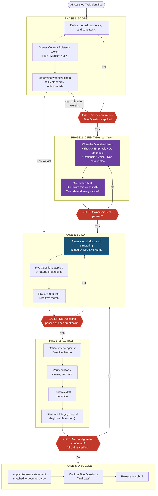

# The Epistemic Stewardship Framework

## A Methodology for Maintaining Intellectual Ownership in AI-Assisted Academic Work

---

## 1. Abstract

The Epistemic Stewardship Framework (ESF) is a comprehensive methodology for maintaining intellectual ownership during AI-assisted academic work. It addresses a structural gap in how higher education engages with artificial intelligence. Existing approaches either prohibit AI use, focus exclusively on student behavior, or treat transparency as a compliance exercise rather than an epistemic practice. None provide faculty with a structured methodology for using AI in their own professional work while preserving the intellectual integrity that academic institutions depend on.

ESF introduces seven core constructs: the Directive Memo, the Five Questions, Content Epistemic Weight, Human Validation Gates, a Phased Workflow Model, a Disclosure Protocol, and a Framework Evolution Protocol. Each is grounded in established scholarship on epistemic agency, distributed cognition, metacognition, and iterative methodology. The framework's central innovation is the Directive Memo: a human-only pre-drafting phase in which the author establishes intellectual authority before any AI-assisted work begins. This mechanism operationalizes the distinction between approving AI-generated content and originating intellectual direction, a distinction that existing frameworks acknowledge in principle but fail to enforce in practice.

ESF serves three audiences (faculty, students, and institutional leadership) with differentiated implementation pathways. It is tool-agnostic, discipline-agnostic, and designed for adoption within a single academic term. The framework includes a built-in evolution protocol that prevents it from becoming a static policy document as AI capabilities change.

This document presents the framework's theoretical grounding, defines its seven constructs, describes its workflow model, and positions its novel contributions against existing literature.

---

## 2. The Problem: An Epistemic Crisis in AI-Assisted Academic Work

Higher education's response to generative AI has consolidated around three approaches. Each addresses a real concern. None addresses the fundamental problem.

### 2.1 The Ban-or-Permit Binary

The first and most widespread response treats AI as a policy question: should students be allowed to use it, and under what conditions? Institutional policies range from outright prohibition to permissive integration. Most settle into conditional frameworks: AI is permitted for brainstorming but not for drafting, or permitted with disclosure but not for graded work. These policies are structurally identical to academic integrity policies governing plagiarism and unauthorized collaboration. They frame AI primarily as a threat to assessment validity.

This framing is insufficient for two reasons. First, it reduces AI engagement to a binary compliance question (permitted or prohibited) when the actual challenge is qualitative. The question is not *whether* AI was used, but *how* the human's epistemic relationship to the work was maintained or degraded during its use. Second, it assumes that the primary risk is deception (students passing off AI work as their own). The more insidious risk is something the policies cannot detect: the gradual erosion of intellectual ownership even in fully disclosed, policy-compliant AI use.

A student who transparently uses AI to draft an essay, edits it lightly, and discloses the collaboration has complied with every policy. They may also have learned nothing and produced work that reflects no genuine intellectual position. The policy succeeded. The education failed.

### 2.2 The Student-Only Focus

The second response targets AI literacy and responsible use, but almost exclusively for students. Zawacki-Richter et al. (2019), in their systematic review of AI applications in higher education, documented a striking asymmetry. The overwhelming majority of research and institutional guidance addresses student-facing AI use. Faculty use of AI in their own professional work receives almost no systematic attention.

This gap has consequences. Faculty who use AI to develop syllabi, draft assessments, write grant proposals, prepare accreditation reports, and produce scholarship operate without methodological guidance. The implicit assumption is that faculty, as domain experts, do not need structured protocols for AI use; that expertise alone is sufficient protection against epistemic drift. This assumption is contradicted by emerging research on metacognitive demands in AI-assisted work. Tankelevitch et al. (2024) demonstrate that even experienced professionals struggle to maintain critical evaluation of AI-generated content, particularly when the output is fluent, well-structured, and plausible. Expertise does not confer automatic immunity to the persuasive quality of competent-sounding AI output.

The asymmetry also creates a credibility problem. Faculty who ask students to practice epistemic responsibility with AI, but who have no structured methodology for their own AI use, model a "do as I say, not as I do" dynamic. Students recognize this, and it undermines the pedagogical authority of AI ethics instruction.

### 2.3 Compliance Framing versus Knowledge-Making Framing

The third response focuses on transparency and disclosure, requiring that AI use be documented and visible. UNESCO's guidance on generative AI in education and research (Miao & Holmes, 2023) and the OECD's AI policy frameworks (2023) both emphasize transparency as a cornerstone of responsible AI integration. This emphasis is correct but incomplete.

Transparency, as currently practiced, operates primarily as a reporting mechanism: the user discloses that AI was used, sometimes specifying what AI did. This is compliance transparency, a record of the collaboration's existence. What it does not address is *epistemic* transparency: the internal process by which the human maintained (or failed to maintain) intellectual ownership of the work.

A disclosure statement that reads "AI assisted with drafting and structural organization" tells the reader that AI was involved. It does not tell the reader, or the author, whether the intellectual direction originated with the human, whether the human's position was preserved through the drafting process, or whether the final output reflects genuine human judgment or passively accepted AI framing. Compliance transparency answers the question "was AI used?" Epistemic transparency answers the question "whose thinking is this?"

### 2.4 The Underlying Problem

These three approaches (policy, student literacy, and compliance transparency) share a common structural limitation: they treat the relationship between humans and AI as a governance problem to be managed rather than an epistemic practice to be developed. They ask how to *regulate* AI use when the fundamental question is how to *think with* AI without ceding the thinking.

ESF reframes the challenge. The problem is not that people use AI. The problem is that AI-assisted work creates conditions under which intellectual ownership erodes gradually, often invisibly, even when every policy is followed and every disclosure is filed. The solution is not better policies. It is a structured methodology that embeds epistemic accountability into the workflow itself, at every phase, for every stakeholder.

---

## 3. Theoretical Grounding

ESF draws on established scholarship across seven concept clusters. Each cluster provides foundational support for one or more of the framework's core constructs.

### 3.1 Epistemic Agency

The framework's central concern (maintaining the human as the originator and owner of intellectual work) is grounded in research on epistemic agency and extended cognition.

Wu et al. (2025) define epistemic agency as the capacity to direct one's own knowledge-making processes: to determine what counts as evidence, how to evaluate claims, and when to revise one's understanding. In AI-assisted work, epistemic agency is at risk not because the AI prevents the human from thinking, but because the AI provides a path of least resistance that bypasses thinking. When AI generates a well-structured, plausible-sounding draft, the human's role shifts from *authoring* to *evaluating*. Evaluation, as Tankelevitch et al. (2024) demonstrate, is cognitively demanding in ways that humans systematically underestimate.

Clark and Chalmers's (1998) extended mind thesis provides the philosophical foundation for understanding AI as a legitimate cognitive partner. Their argument, that cognitive processes can extend beyond the brain into the environment including tools and technologies, establishes that using AI for intellectual work is not inherently problematic. However, their framework includes a critical condition: the human must actively endorse the external resource's contributions. Passive acceptance (treating AI output as one's own without evaluative engagement) violates the conditions under which extended cognition supports rather than supplants human thinking.

Hutchins's (1995) distributed cognition framework extends this analysis to the systems level. In Hutchins's account, cognition is distributed across people, tools, and artifacts in a system. The key insight for ESF is that distributed cognition requires coordination. Someone or something must ensure that the contributions of different components serve a coherent purpose. In AI-assisted academic work, that coordination function must remain with the human. When it migrates to the AI (when the AI's organizational logic becomes the default structure of the work), the human has lost epistemic agency even if they retain editorial control.

Bozkurt (2024) applies these theoretical concerns directly to AI in education, arguing that generative AI tools create a fundamental tension between efficiency and epistemic development. The convenience of AI-assisted production can undermine the cognitive struggle that learning requires. This tension applies not only to students but to any knowledge worker using AI for intellectual tasks.

### 3.2 Metacognition and Human Oversight

If epistemic agency defines what must be preserved, metacognition describes the mechanism by which it is preserved or lost.

Tankelevitch et al. (2024) provide the most directly relevant empirical foundation for ESF's approach. Their research on metacognitive demands in AI-assisted decision-making demonstrates that human oversight of AI output is not the simple "review and approve" process that most frameworks assume. Effective oversight requires sustained metacognitive effort: monitoring one's own comprehension, detecting when AI-generated content departs from one's own understanding, and resisting the cognitive pull of fluent, well-structured output that *feels* correct. Their findings show that this metacognitive work is effortful, fatiguing, and prone to systematic failures, particularly when users are under time pressure or when the AI output is close to (but subtly different from) what the human would have produced independently.

Atchley et al. (2024) extend this analysis with the concept of cognitive automation: AI, functioning as an external representation tool, can reduce information processing demands in ways that carry a corresponding cost: reduced cognitive engagement with the work's substance. Pedagogical recommendations, they argue, must account for these cognitive effects. The implication for academic work is that the efficiency gains of AI assistance may diminish rather than maintain critical engagement with what the AI produces.

Fischer et al. (2024) bring evaluative judgment scholarship to bear on this concern. Drawing on a practice theory approach, they find that summative assessment focused on final products misses the informal evaluative practices: incidental conversations, peer judgments, self-assessments: that constitute the actual development of evaluative judgment. Their argument that assessment must attend to what learners *actually do* (making cognitive process visible alongside product) directly supports ESF's gate records and Integrity Reports as process documentation rather than product evaluation alone.

Bearman et al. (2023), in a discourse analysis of how AI is framed in the higher education literature, find that institutional responses cluster around two Discourses; AI as inevitable change and AI as redistributor of authority: both of which attend to AI's structural role while leaving accountability for how AI mediates cognitive engagement unaddressed. The accountability gap they identify at the discourse level motivates ESF's structural approach: building accountability mechanisms into the workflow rather than leaving them to policy.

The EU AI Act, Article 14 (2024), codifies the principle of human oversight in regulatory form, requiring that AI systems designed for high-risk applications include mechanisms ensuring effective human oversight. While the Act targets AI system design rather than user behavior, its underlying logic aligns with ESF's insistence on embedded validation gates rather than discretionary review. Human oversight must be structural, not merely aspirational.

### 3.3 Content Stakes and Epistemic Weight

Not all intellectual work carries the same epistemic stakes. A meeting agenda and a tenure portfolio demand different levels of human origination.

Perkins et al. (2024) provide the most direct precedent with the AI Assessment Scale (AIAS), which defines levels of AI involvement in student assessment from no AI use through full AI-generated content. AIAS is a significant contribution: it replaces the binary of "permitted/prohibited" with a graduated scale. However, AIAS frames epistemic weight as a *policy choice*; instructors decide how much AI is permitted for a given assignment. ESF treats epistemic weight as an *inherent property of the content type*. Some content inherently requires more human origination regardless of what a policy permits. The difference is between asking "how much AI should the policy allow here?" and asking "how much human intellectual authority does this content demand?"

Bloom et al. (1956), though predating AI by decades, provide the taxonomic logic that underpins content epistemic weight. The hierarchy from recall through evaluation and synthesis maps to a natural gradient of human cognitive involvement. AI can reliably assist with tasks at lower taxonomic levels (recalling information, organizing known content), but human judgment becomes progressively more essential at higher levels (evaluating claims, synthesizing across domains, creating original frameworks). This mapping is not a policy. It reflects the cognitive architecture of the tasks themselves.

### 3.4 Transparency and Structural Disclosure

ESF's approach to disclosure builds on existing frameworks while extending them from compliance reporting to epistemic accountability.

Weaver's (2024) AI Disclosure (AID) framework represents the most developed approach to AI transparency in academic contexts. AID provides structured templates for documenting AI use, advocating for transparency as a professional norm. ESF extends AID in two directions. First, by connecting disclosure to a pre-drafting intellectual authority mechanism (the Directive Memo) that gives the disclosure substantive meaning. Second, by introducing the Integrity Report as a companion artifact that documents not just what AI did, but whether the human's intellectual direction was preserved through the process.

UNESCO's guidance on generative AI in education and research (Miao & Holmes, 2023) establishes transparency as a foundational principle for AI in educational contexts, emphasizing the need for clear documentation of AI involvement in knowledge production. The OECD's AI principles (2023) reinforce this at the policy level. ESF translates these principles from aspirational guidance to operational workflow. Transparency is not a value to be endorsed but a structural feature of how the work is produced.

### 3.5 Cognitive Load and the Educational Paradox

Sweller's (1988) cognitive load theory introduces a critical tension for AI in education. The theory demonstrates that learning is optimized when extraneous cognitive load is minimized, allowing cognitive resources to be directed toward germane processing, the mental effort that produces learning.

AI tools reduce cognitive load. That is their primary value proposition. But in educational contexts, this creates a paradox: the cognitive effort that AI eliminates may be precisely the effort that learning requires. A student who uses AI to organize their argument spends less effort on organization, but organization is a thinking skill. A faculty member who uses AI to draft a syllabus spends less effort on articulating the course's intellectual architecture, but that articulation is a form of pedagogical reasoning.

ESF does not resolve this paradox by restricting AI use. Instead, it introduces structural mechanisms (the Directive Memo, the Five Questions) that reintroduce targeted cognitive effort at the points where it matters most: intellectual direction, evaluative judgment, and epistemic accountability. The framework redistributes cognitive load rather than simply reducing it.

### 3.6 Iterative Methodology

ESF's phased workflow model draws on two distinct methodological traditions (iterative design and assessment literacy), bridging them in a way that neither has achieved independently.

From design methodology, Brown's (2008) articulation of design thinking provides the iterative structure: cycles of divergent exploration and convergent decision-making, with human judgment operating at each convergence point. Torrance (2019) extends iterative methodology into learning and development contexts. Effective professional practice, Torrance argues, requires structured cycles of planning, execution, reflection, and revision, with explicit decision gates separating each phase.

Luksha et al. (2024) apply iterative thinking to educational futures, arguing that universities must develop adaptive methodologies capable of evolving as technology and social conditions change. Their emphasis on built-in revision mechanisms directly supports ESF's Framework Evolution Protocol.

Zawacki-Richter et al. (2019), in addition to documenting the faculty-facing gap, provide a methodological contribution. Their systematic review establishes that AI-in-education research has progressed through identifiable phases (from intelligent tutoring systems through adaptive learning to generative AI). This suggests that frameworks for AI use must be designed with evolution in mind rather than attempting to define permanent solutions.

### 3.7 AI Literacy as Epistemic Practice

The final cluster addresses AI literacy, but reframes it from technical proficiency to epistemic practice.

Allen and Kendeou (2024) argue for AI literacy as a fundamental civic and professional competency. This encompasses not just the ability to use AI tools but the capacity to critically evaluate AI-generated content, understand AI systems' limitations, and make informed decisions about when and how to use AI. Their framing aligns with ESF's emphasis on epistemic agency over technical skill.

Kassorla et al. (2024) translate AI literacy into higher education institutional practice, providing frameworks for integrating AI competencies across curricula. Their work identifies a gap that ESF addresses: while AI literacy frameworks define what students should understand about AI, they rarely specify the *methodology* by which that understanding is practiced.

Luckin et al. (2016) provide foundational work on intelligence and AI in education. They argue that AI's educational value depends on how it is deployed: as a tool for empowerment (supporting human agency) or as a substitute for human effort (undermining development). This distinction between empowerment and substitution runs through ESF's entire architecture.

---

## 4. Core Constructs

ESF comprises seven interlocking constructs. Each is defined, grounded in the scholarship described above, operationalized for practice, and differentiated from existing approaches.

### 4.1 The Directive Memo

**Definition.** The Directive Memo is a human-only pre-drafting document in which the author establishes the intellectual direction, position, and intent of the work before any AI-assisted production begins. It is not a prompt. It is not an outline. It is a declaration of intellectual authority: a statement of what the work is about, what it emphasizes, what it sets aside, and why, authored entirely by the human without AI assistance.

**Scholarly grounding.** The Directive Memo operationalizes Clark and Chalmers's (1998) condition of active endorsement in extended cognition. For AI to function as a legitimate extension of the human's cognitive process, the human must actively endorse the contributions the tool makes. The Directive Memo creates the standard against which endorsement is measured. If the AI's output aligns with the memo's direction, the human can genuinely endorse it; if it drifts, the human can detect and correct the drift. Without the memo, "endorsement" reduces to "I didn't notice anything wrong," which is precisely the passive acceptance that extended mind theory warns against.

The Directive Memo also addresses Wu et al.'s (2025) concern about epistemic agency by requiring the human to articulate their position *before* the AI provides its synthesis. This temporal ordering is critical. Once an AI has produced a well-structured draft, the human's own position becomes harder to distinguish from the AI's framing. The memo captures human intellectual direction in its uncontaminated form.

**Practical operation.** A Directive Memo includes:
- **Thesis:** What is this work fundamentally arguing, claiming, or presenting?
- **Emphasis:** What matters most? What should the audience take away above all else?
- **De-emphasis:** What did the research or context surface that is intentionally being set aside or subordinated?
- **Rationale:** Why this approach? What informs this judgment?
- **Voice and stance:** How should this work read? What register, tone, and posture?
- **Non-negotiables:** What must appear exactly as specified, regardless of what the AI drafts?

The memo can be brief. Its function is not comprehensiveness but *commitment*, forcing the author to articulate intent before delegation begins.

**Differentiation.** No existing framework in the AI-in-education literature requires a pre-drafting intellectual authority mechanism of this kind. AIAS (Perkins et al., 2024) defines levels of AI involvement but does not specify how human intellectual direction is established before AI engagement begins. AID (Weaver, 2024) addresses disclosure after the work is complete but does not structure the production process itself. The Directive Memo fills a structural gap: it is the mechanism that makes post-hoc disclosure meaningful, because it establishes the standard against which the work's intellectual integrity can be assessed.

### 4.2 The Five Questions

**Definition.** The Five Questions are moment-to-moment epistemic checkpoints applied at every human validation gate in the ESF workflow. They are:

1. **Can I defend this?** Could I explain and justify every claim in this work to a colleague, reviewer, or student without referencing the AI's reasoning?
2. **Is this mine?** Does this reflect my actual position, or did I passively accept the AI's framing because it sounded reasonable?
3. **Did I verify?** Have I independently confirmed factual claims, citations, and data points?
4. **Would I teach this?** Am I prepared to stand behind this content in a classroom, boardroom, or review committee and respond to challenges?
5. **Is the disclosure honest?** Does my disclosure statement accurately represent the division of intellectual labor?

**Scholarly grounding.** The Five Questions operationalize the metacognitive monitoring that Tankelevitch et al. (2024) demonstrate is necessary for effective human oversight of AI output. Each question targets a specific metacognitive failure mode: accepting plausible-sounding content without evaluative engagement (Question 2), failing to verify factual claims (Question 3), and treating disclosure as a formality rather than an accountability mechanism (Question 5). Atchley et al.'s (2024) cognitive automation concept; AI as an external representation that reduces information processing demands, with a corresponding cost to cognitive engagement: justifies the Five Questions' role as a repeated, structured intervention rather than a one-time checklist.

**Practical operation.** The Five Questions are not a post-hoc audit. They are applied at every phase transition in the ESF workflow: after scoping, after building, before finalizing. The same questions recur, but the answers may change as the work develops. A "yes" to "Is this mine?" after the scoping phase has different meaning than "yes" after a full AI-assisted draft. The repetition is intentional: it counteracts the cognitive automation that Atchley et al. describe.

**Differentiation.** While many AI ethics frameworks include reflection prompts, none specify structured decision gates at this granularity: recurring, specific questions applied at defined workflow transitions. The Five Questions are behavioral mechanisms, not philosophical principles. They are designed to be answerable (yes or no), and a "no" answer at any gate halts the workflow until the issue is resolved.

### 4.3 Content Epistemic Weight

**Definition.** Content Epistemic Weight is a three-tier classification system that calibrates the required depth of human involvement based on the inherent epistemic demands of the content type. The three tiers are:

- **High weight:** Content where the intellectual position, evaluative judgment, or original argument must originate with the human. Examples: learning outcomes, assessment criteria, thesis statements, tenure materials, accreditation reports, original scholarship. Full ESF workflow required, including Directive Memo and Integrity Report.
- **Medium weight:** Content where the human must substantively shape the direction and evaluate the result, but AI can contribute to structure and drafting. Examples: syllabi sections, assignment descriptions, lecture outlines, reading guides, internal strategy documents. Standard ESF workflow with disclosure.
- **Low weight:** Content where AI can draft with light human review. Examples: schedules, formatting, resource lists, administrative language, meeting agendas. Abbreviated workflow with attribution.

**Scholarly grounding.** The tiered model draws on Bloom et al.'s (1956) taxonomic logic (higher-order cognitive tasks such as evaluation, synthesis, and creation inherently demand more human engagement than lower-order tasks such as recall and organization) and on Perkins et al.'s (2024) AIAS, which establishes the principle of graduated AI involvement.

**Practical operation.** Content Epistemic Weight is assessed at the beginning of any AI-assisted task (Phase 1 of the ESF workflow). The classification determines which workflow components are required. High-weight content triggers the full workflow, including a Directive Memo and Integrity Report. Medium-weight content requires the standard workflow with disclosure. Low-weight content requires only attribution. The human classifies the content. The framework does not prescribe weight assignments, because classification itself requires the professional judgment that ESF is designed to preserve.

**Differentiation.** AIAS (Perkins et al., 2024) provides the closest precedent, but treats AI involvement levels as policy choices assigned by instructors to student assessments. ESF treats epistemic weight as an inherent property of the content type: not "how much AI should the policy allow?" but "how much human intellectual authority does this content demand?" This reframing shifts the locus of the question from policy to epistemology.

### 4.4 Human Validation Gates

**Definition.** Human Validation Gates are mandatory checkpoints at phase transitions in the ESF workflow. At each gate, the human must confirm, using the Five Questions, that they remain the epistemic agent of the work, not merely the editor.

**Scholarly grounding.** The gate mechanism directly addresses the metacognitive failures documented by Tankelevitch et al. (2024) and the cognitive automation described by Atchley et al. (2024). By requiring explicit confirmation at each phase transition, gates prevent the gradual, often invisible migration of intellectual authority from human to AI. They also implement the principle of human oversight articulated in the EU AI Act, Article 14 (2024), translating regulatory intent into operational practice.

Fischer et al.'s (2024) argument for assessment that attends to what learners *actually do* is realized through gates. The gate does not evaluate the product but interrogates the process: did the human maintain evaluative engagement, or did they accept the AI's output without genuine scrutiny?

**Practical operation.** Gates occur at defined transitions in the ESF workflow: after scoping, after the Directive Memo, after building, after critical review, and before finalization. Each gate requires the human to pause, apply the Five Questions, and either confirm progression or identify where epistemic drift has occurred. A gate failure (a "no" answer to any of the Five Questions) halts the workflow until the issue is resolved.

To prevent gates from becoming pro forma (a known risk when any checkpoint becomes routine), each gate produces a **Gate Verification Record**: a brief, structured artifact documenting that the human genuinely engaged rather than passively approved. The record captures:

- **What was reviewed.** Which sections, claims, or decisions did the human actually examine? A gate that reviews "the whole document" without specifics is a flag that the review was superficial.
- **What was changed.** Substantive modifications, additions, or redirections that resulted from the review. A gate that produces zero changes is not automatically suspect; the work may be sound. But it should be noted and justified.
- **What was challenged.** Points where the human questioned the AI's contribution, disagreed with the framing, or identified drift from the Directive Memo, even if the original was ultimately retained. The presence of challenges is evidence of evaluative engagement; their complete absence may indicate passive acceptance.
- **What was decided.** Explicit decisions made at the gate: proceed, revise, redirect, or halt. Decisions should reference the Five Questions, noting which questions were hardest to answer affirmatively and why.

The Gate Verification Record is not a bureaucratic form. It can be as brief as a few sentences for low-weight content or a structured document for high-weight content. Its function is *evidentiary*: it creates a trace of human cognitive engagement that distinguishes genuine review from performative approval. In multi-phase projects, the accumulated gate records form a narrative of the human's intellectual involvement across the entire production process.

**Differentiation.** While iterative design methodologies include review points, and assessment frameworks include quality checks, no existing AI-in-education framework specifies mandatory epistemic checkpoints at workflow transitions with explicit halt conditions and documented verification of human engagement. The gate mechanism, including the verification record, distinguishes ESF from frameworks that recommend review without structuring it or verifying that it occurred.

### 4.5 The Phased Workflow Model

**Definition.** ESF defines a generalized five-phase workflow for AI-assisted academic work:

1. **Scope**: Define the task, determine Content Epistemic Weight, establish constraints and success criteria.
2. **Direct**: Write the Directive Memo (for high and medium-weight content). Establish intellectual authority before any AI-assisted production.
3. **Build**: AI-assisted drafting, structuring, and iteration, guided by the Directive Memo and monitored through the Five Questions.
4. **Validate**: Critical review against the Directive Memo, verification of claims and citations, epistemic drift detection, Integrity Report for high-weight content.
5. **Disclose**: Apply appropriate disclosure statement, generate the Integrity Report (if not produced in Phase 4), confirm release-readiness.

**Scholarly grounding.** The phased model draws on Brown's (2008) design thinking methodology (iterative cycles with human judgment at convergence points), Torrance's (2019) structured professional development cycles (plan, execute, reflect, revise), and the EU AI Act's (2024) structural approach to human oversight. The temporal ordering of the phases is theoretically motivated: the Directive Memo (Phase 2) precedes AI-assisted production (Phase 3) because Clark and Chalmers's (1998) active endorsement condition requires that the human's position be established before the AI's contributions are integrated.

**Practical operation.** The five phases are adaptable to task complexity. For low-weight content, Phases 2 and 4 may be abbreviated or omitted. For high-weight content, all phases are required in full. The model is tool-agnostic. It applies whether the human is using a general-purpose chatbot, a specialized AI assistant, or a multi-agent system.

**Differentiation.** Existing iterative frameworks (design thinking, agile methodology) provide phase structures but do not embed epistemic accountability at each phase. Existing AI-in-education frameworks (AIAS, AID) provide assessment and disclosure models but do not define the production process that precedes them. ESF bridges these two traditions: iterative methodology *with* epistemic accountability at every phase.

### 4.6 The Disclosure Protocol

**Definition.** The Disclosure Protocol is a system of structured transparency comprising two components: a disclosure statement matched to the document type and audience, and an Integrity Report that documents the epistemic process behind the work.

The disclosure statement communicates to the reader the nature and extent of AI collaboration. The Integrity Report, an internal accountability artifact, documents the Directive Memo, confirms alignment between the memo and the final output, provides a breakdown of AI contribution by dimension (structural organization, language drafting, research synthesis, original ideas, domain judgment), and flags any concerns or drift.

**Scholarly grounding.** The Disclosure Protocol extends Weaver's (2024) AID framework by connecting disclosure to the pre-drafting intellectual authority mechanism (the Directive Memo) and by introducing the Integrity Report as a mechanism for epistemic accountability beyond compliance reporting. It implements UNESCO's (Miao & Holmes, 2023) and the OECD's (2023) transparency principles by translating them from aspirational guidance to structural workflow components.

**Practical operation.** Disclosure statements are calibrated to document type:
- **High-weight content** (scholarship, accreditation reports, tenure materials): Full disclosure statement plus Integrity Report.
- **Medium-weight content** (syllabi, assignment descriptions, internal documents): Standard disclosure statement.
- **Low-weight content** (schedules, formatting, resource lists): Attribution footer.

Templates are provided for common academic document types: scholarship, course materials, institutional reports, application materials, and general use.

**Differentiation.** Existing disclosure frameworks treat transparency as a reporting mechanism: what AI was used, and how it contributed. ESF's Disclosure Protocol treats transparency as an epistemic mechanism. The disclosure is meaningful because it is anchored to the Directive Memo (which establishes what the human intended) and verified through the Integrity Report (which confirms whether the intention was preserved). Disclosure without a Directive Memo is compliance. Disclosure with a Directive Memo is accountability.

### 4.7 The Framework Evolution Protocol

**Definition.** The Framework Evolution Protocol is a set of structural mechanisms ensuring that ESF does not become a static policy document as AI capabilities, research, and institutional contexts evolve. It comprises four components:

1. **Versioned framework with changelog.** Every revision to ESF is documented with version numbers, dates, and descriptions of what changed and why. This creates an auditable record of the framework's evolution.

2. **Research intake cycle.** On a quarterly or per-term basis, new scholarship is evaluated against ESF's theoretical grounding. Sources are assessed using the same verification standards applied to the framework's original citations: confirmed existence, accurate representation, and epistemic marking ([ESTABLISHED], [INFERRED], [UNVERIFIED], [PREPRINT]). New sources may reinforce existing constructs, refine their definitions, or challenge their validity.

3. **Challenge protocol.** When new research contradicts an ESF construct or its supporting evidence, the contradiction is documented explicitly, not quietly absorbed through revision. The framework maintains a record of challenges, the evidence supporting them, and the resolution (construct upheld, refined, or retired). This creates transparency about the framework's epistemic evolution, not just its current state.

4. **Sunset criteria.** Each construct includes conditions under which it should be revisited, revised, or retired. For example: if future research demonstrates that pre-drafting intellectual authority mechanisms do not improve epistemic outcomes compared to post-hoc review alone, the Directive Memo's central role should be reconsidered. Sunset criteria prevent constructs from persisting through institutional inertia rather than demonstrated value.

**Scholarly grounding.** The Framework Evolution Protocol draws on Luksha et al.'s (2024) argument that educational institutions need adaptive methodologies capable of evolving with technological and social change, and on Zawacki-Richter et al.'s (2019) observation that AI-in-education has progressed through identifiable phases, suggesting that current approaches are necessarily provisional. The challenge protocol operationalizes the epistemic values the framework itself advocates: claims should be supported, contradictions should be surfaced, and intellectual positions should be held accountable to evidence.

**Practical operation.** At the framework level, the Evolution Protocol is maintained by the framework's stewards (whether an individual faculty member, a committee, or an institutional unit). At the institutional level, the protocol aligns with annual review cycles and accreditation timelines. At the individual level, practitioners can apply the protocol to their own ESF implementation, noting when constructs are more or less useful in their context and contributing feedback to the framework's revision process.

**Differentiation.** No comparable AI-in-education framework includes structural mechanisms for self-revision. AIAS, AID, and UNESCO's guidance are presented as current best practice without built-in mechanisms for challenging or evolving their own recommendations. This is understandable given their publication contexts, but it means that frameworks must be replaced rather than evolved when they no longer fit. ESF's Evolution Protocol is designed to prevent this obsolescence by building revision into the framework's architecture.

---

## 5. The ESF Workflow Model

The following diagram and narrative describe the generalized ESF workflow. This model is abstracted from operational practice and is designed to be adaptable to any AI-assisted academic task, regardless of discipline, tool, or institutional context.

### 5.1 Workflow Diagram

### 5.2 Workflow Narrative

**Phase 1: Scope.** Every AI-assisted task begins with scoping. The human identifies the task, its audience, and its constraints, then assesses the Content Epistemic Weight. This assessment determines the workflow's depth. High-weight content requires the full five-phase workflow. Medium-weight content requires the standard workflow with disclosure. Low-weight content may proceed directly to the Build phase with an abbreviated workflow.

The scope phase includes a Human Validation Gate. Before proceeding, the human confirms that the task definition is accurate, the weight assessment is appropriate, and the Five Questions can be answered affirmatively at this early stage. This may seem premature; the work hasn't started yet. But the scoping gate serves a specific function: it establishes the human's conscious engagement with the task before delegation to AI begins. A "no" to "Is this mine?" at the scoping stage means the human hasn't yet formed a position on the work. Proceeding without a position is precisely how epistemic drift begins.

**Phase 2: Direct.** For high and medium-weight content, the human writes a Directive Memo. This phase is entirely human, with no AI involvement. The memo establishes the intellectual direction that all subsequent phases must serve: what the work argues, what it emphasizes, what it sets aside, and why.

The Directive Memo passes the Ownership Test: the human confirms they wrote it without AI assistance, can defend every choice to a peer, and that it reflects their genuine intellectual position rather than a synthesis of what sources suggested. This test guards against a subtle failure mode in which the human, having read AI-generated research summaries in Phase 1, unconsciously adopts the AI's framing as their own position.

**Phase 3: Build.** AI-assisted production begins, guided by the Directive Memo. The human and AI collaborate on drafting, structuring, iterating, and refining the work. Throughout this phase, the Five Questions are applied at natural breakpoints: after completing a section, after a significant revision, after incorporating new material.

Critical to this phase: when the AI's output departs from the Directive Memo's direction, the departure is flagged explicitly, by the human, by the AI (if the system supports it), or by both. Departures are not automatically errors; the AI may surface valid considerations that the memo didn't anticipate. But departures must be conscious choices, not silent drift. The human decides whether to update the memo (revising their position) or redirect the AI (maintaining their position). Both are legitimate. Undetected drift is not.

**Phase 4: Validate.** The completed draft undergoes critical review. The Validate phase is not copyediting; it is epistemic audit. The human reviews the work against the Directive Memo, checking for alignment between the original intent and the final output. Citations and factual claims are independently verified. Any drift from the memo's direction is documented: where did the work depart from the stated thesis, emphasis, or stance?

For high-weight content, the validation phase produces an Integrity Report. This is a structured document recording the Directive Memo alignment check, AI contribution levels by dimension, verification status, and any flagged concerns. The Integrity Report is an internal accountability artifact. It accompanies the work as evidence that the epistemic process was followed, not just that the product is polished.

**Phase 5: Disclose.** The appropriate disclosure statement is applied, matched to the document type and audience. The Five Questions are applied one final time as the last gate before the work is released. The human confirms that the disclosure accurately represents the division of intellectual labor, and that every prior gate was genuinely passed rather than pro forma.

### 5.3 Gate Verification in Practice

Every Human Validation Gate produces a Gate Verification Record, a brief artifact documenting the human's actual engagement. The record answers four questions: *What was reviewed? What was changed? What was challenged? What was decided?*

The depth of the record scales with Content Epistemic Weight:

**High-weight gates** produce a structured record that becomes part of the Integrity Report. For example, a gate after the Build phase of an accreditation report might record: "Reviewed all five recommendation sections. Changed the framing of Recommendation 3 from cost-driven to mission-driven; the AI defaulted to efficiency language that doesn't match how we argue for resources at this institution. Challenged the citation of the 2023 SACSCOC standard; verified it applies but noted it's under revision. Decision: proceed to Validate with the reframed recommendation."

**Medium-weight gates** produce a brief note, a few sentences documenting the review's substance. For a syllabus section: "Reviewed weekly schedule. Moved the ethics discussion from Week 8 to Week 4; students need this framing before the first major project, not after. No other changes. Proceed."

**Low-weight gates** require only a confirmation with the decision recorded. For a resource list: "Spot-checked five citations. All resolve. Proceed."

The critical function of the record is *distinguishing genuine engagement from performative approval.* A gate record that says "reviewed and approved" with no specifics is a signal, to the author, to future reviewers, and to institutional auditors, that the gate may not have functioned as intended. The record does not need to be long. It needs to be *specific.*

In multi-phase projects, gate records accumulate into a narrative of human intellectual involvement. This narrative serves two purposes: it provides evidence for the Integrity Report (Phase 4), and it gives the author a retrospective trace of their own decision-making. This trace is useful for detecting patterns of drift or disengagement that might not be visible in the moment.

### 5.4 Workflow Adaptations

The five-phase model is designed for high-weight content produced through deliberate AI collaboration. In practice, not every AI-assisted task requires all five phases:

- **High-weight content** (original scholarship, accreditation reports, assessment design): Full five-phase workflow with Directive Memo, Integrity Report, and formal disclosure.
- **Medium-weight content** (syllabi, assignment descriptions, project briefs): Standard workflow with Directive Memo (may be abbreviated) and standard disclosure.
- **Low-weight content** (schedules, formatting, resource compilation): Abbreviated workflow consisting of Scope (including weight assessment), Build, and Disclose (attribution footer).

The model is also recursive. Complex projects may apply the workflow at multiple levels. A complete course design, for example, might apply the full workflow to the overall course architecture while applying abbreviated workflows to individual session schedules within it.

---

## 6. The Two-Level Architecture

ESF operates at two levels with different process models, audiences, and purposes. The underlying principles (epistemic ownership, human gates, transparency) are shared. How they are applied differs fundamentally.

### 6.1 Level 1: Content Production

**Audience:** Faculty, administrators, institutional leaders, and anyone who uses AI to produce work that others will consume, implement, or be assessed by.

**Process model:** Scope, Direct, Build, Validate, Disclose (the five-phase workflow described in Section 5).

**Purpose:** Ensure that AI-assisted institutional and scholarly work maintains intellectual integrity. Level 1 gates ask: *Is this good enough to put into the world?*

Faculty are ESF's primary Level 1 audience. The framework provides a structured methodology for using AI in professional academic work: curriculum development, assessment design, scholarship, grant writing, administrative reporting. All while maintaining intellectual ownership. The Faculty Implementation Guide (forthcoming) translates ESF's constructs into discipline-agnostic workflows with worked examples from multiple disciplines.

Key faculty applications:
- Writing Directive Memos before AI-assisted drafting of syllabi, assessments, and scholarship
- Classifying Content Epistemic Weight to calibrate effort appropriately
- Applying the Five Questions at natural decision points in their workflow
- Generating Integrity Reports for high-stakes deliverables
- Modeling epistemic stewardship in their own practice before requiring it of students
- Designing assignments that scaffold Level 2 for students

The last two points are critical. Faculty credibility in AI-integrated teaching depends on practicing what they preach. And Level 1 practitioners *create the conditions* in which Level 2 learners develop. A professor using ESF to design an assignment is simultaneously designing the epistemic environment a student works within.

### 6.2 Level 2: Epistemic Development

**Audience:** Students, meaning learners developing the capacity to become Level 1 practitioners.

**Process model:** Inquire, Position, Explore, Make, Reflect (a design thinking and Socratic process distinct from the Level 1 workflow).

**Purpose:** Develop epistemic agency through structured engagement with AI in coursework. Level 2 gates ask: *Do I actually understand what I'm doing?*

The Level 2 process model reflects a fundamental distinction: students are not producing institutional documents with epistemic rigor. They are *learning to think*. The production workflow (Scope, Direct, Build, Validate, Disclose) optimizes for output quality. The student process optimizes for cognitive development. Both maintain epistemic ownership, but through different mechanisms.

**The Student Process Model**

| Phase | Design Thinking Parallel | Mechanism | Human Gate |
|-------|--------------------------|-----------|------------|
| **Inquire** | Empathize | Socratic questioning: What is the problem? What do I already know? What assumptions am I making? | *Can I explain this in my own words?* |
| **Position** | Define | Articulate MY stance, emphasis, and non-negotiables, before AI enters | *Have I written my position before consulting AI?* |
| **Explore** | Ideate | Engage AI as thinking partner: generate options, challenge assumptions, pressure-test thinking | *Can I distinguish my ideas from AI's suggestions?* |
| **Make** | Prototype | Build the work product with AI assistance, Five Questions active throughout | *Does this still reflect my position, or did I drift?* |
| **Reflect** | Test | Evaluate output, document what was kept/revised/rejected and why | *Can I defend every part of this?* |

The critical design move: **AI does not enter until Phase 3.** Phases 1 and 2 are human-only. The Socratic questioning in the Inquire phase and the written position in the Position phase force students to articulate their own understanding *before* they have AI output to react to. This sequencing is supported by multiple independent research traditions. Hutson's (2025) three-tiered scaffolded framework requires demonstrated independent proficiency before AI access. The Human-AI-Human cycle (Washington OSPI, 2024) mandates that human inquiry precede AI production. Pasmala et al.'s (2026) five-stage RBL-AI model structures human-led problem identification and research planning as the foundational phases before AI-enhanced analysis enters, with an explicit design principle that "ethical judgment and scholarly responsibility remain learner- and instructor-centered."

This is not the Level 1 workflow simplified. It is a different process serving a different purpose. Level 1 begins with Scope (task definition) because the practitioner already has epistemic agency and needs a workflow to preserve it. Level 2 begins with Inquire (understanding) because the student is *developing* epistemic agency and needs a process to build it.

**Four Engagement Levels** describe the scaffolding progression:

| Level | Name | Operating Phases | Gate Scaffolding |
|-------|------|-----------------|------------------|
| 1 | Discovery | Inquire + Position (learning to articulate before AI) | Instructor scaffolds all gates |
| 2 | Guided Use | Full process with structured parameters | Instructor designs gates into assignments |
| 3 | Independent Use | Full process, self-directed | Self-assessed gates with peer review |
| 4 | Critical Partnership | Full process + designing gates for others | Students create and evaluate their own gates |

ESF does not frame students as potential cheaters who need monitoring. It frames them as developing epistemic agents who need a process that makes their thinking visible, to themselves and to their instructors, at every phase. The human gates require demonstration of understanding, not permission to proceed.

Process artifacts (records of what was kept, revised, and rejected from AI output, and why) serve as evidence of cognitive engagement (Plate & Hutson, 2025; Gobbo, 2025). These are not compliance documents. They are the visible trace of the editorial judgment that constitutes learning.

### 6.3 The Relationship Between Levels

The two levels are not independent. Level 1 practitioners design the environments in which Level 2 learners develop. This creates a structural accountability: faculty who have not practiced epistemic stewardship in their own work (Level 1) cannot credibly scaffold it for students (Level 2).

The ESF constructs translate across levels:

| Construct | Level 1 (Faculty) | Level 2 (Student) |
|-----------|-------------------|-------------------|
| Pre-drafting authority | Directive Memo (full) | Position Statement (3 elements) |
| Epistemic checkpoints | Five Questions at phase transitions | Five Questions activated Phase 3 onward |
| Content calibration | Content Epistemic Weight (self-classified) | Assignment parameters (instructor-set or self-classified at higher levels) |
| Process evidence | Integrity Report + Gate Verification Records | AI Use Log + process artifacts (kept/revised/rejected) |
| Transparency | Disclosure Protocol (by document type) | Disclosure + reflection |

### 6.4 Institutional Leadership

Institutional leaders (provosts, deans, department chairs, assessment directors, accreditation officers) govern both levels. They need ESF for policy development, faculty evaluation, student outcomes assessment, and accreditation. The Institutional Implementation Guide (forthcoming) provides a phased rollout model (pilot, expand, institutionalize), an accreditation crosswalk mapping ESF to SACSCOC, HLC, NASAD, ABET, and other accreditors, and assessment rubrics for evaluating framework adoption at faculty, student, and institutional levels.

Institutional assessment should differentiate the two levels. Level 1 is assessed on production quality and epistemic rigor. Level 2 is assessed on epistemic development and demonstrated learning. Conflating the two (evaluating students by the same criteria used for faculty work) misses the developmental purpose of Level 2.

ESF's Framework Evolution Protocol is particularly relevant at the institutional level, where AI policy risks becoming a static compliance document reviewed only when problems arise. The Evolution Protocol provides a structured mechanism for ongoing revision (research intake, challenge documentation, and sunset criteria) that keeps institutional AI policy responsive rather than reactive.

---

## 7. Novel Contributions

ESF makes five claims of novel contribution to the literature on AI in higher education. Each is positioned against existing work, with evidence of the gap and an account of how ESF addresses it.

### 7.1 The Directive Memo: Pre-Drafting Intellectual Authority

**Claim.** No existing framework in the AI-in-education literature requires a human-only pre-drafting phase in which the author establishes intellectual authority before AI-assisted production begins.

**Evidence of gap.** AIAS (Perkins et al., 2024) defines levels of AI involvement in student assessment but does not address how human intellectual direction is established before AI engagement. AID (Weaver, 2024) structures disclosure after the work is complete but does not intervene in the production process. UNESCO (Miao & Holmes, 2023) and the OECD (2023) advocate for human agency in AI-assisted work but do not specify mechanisms for asserting it. The extended mind literature (Clark & Chalmers, 1998) defines the conditions for legitimate cognitive extension but does not operationalize them for AI-assisted academic work.

**How ESF fills it.** The Directive Memo operationalizes the extended mind thesis's active endorsement condition by requiring the human to articulate their intellectual position before the AI provides its synthesis. It creates the evaluative standard against which all subsequent AI contributions are assessed. This transforms post-hoc disclosure from "AI helped with this" into "here is what I intended, here is what AI contributed, and here is the evidence that my intention was preserved."

### 7.2 Calibrated Epistemic Weight as Framework Logic

**Claim.** ESF reframes content-level AI involvement from a policy choice (how much AI should be *allowed*) to an epistemic property (how much human intellectual authority does this content *demand*).

**Evidence of gap.** AIAS (Perkins et al., 2024) provides the closest precedent with its graduated AI involvement scale. However, AIAS positions these levels as instructor-assigned policy decisions for student assessments. The implicit framing is permissive: the instructor decides how much AI is acceptable. ESF reframes this. Some content inherently demands more human origination, and the framework's role is to make that demand visible and actionable, for faculty, students, and institutions alike.

**How ESF fills it.** Content Epistemic Weight is treated as an inherent property derived from the cognitive demands of the content type (supported by Bloom et al., 1956), not as an administratively assigned permission level. This reframing shifts the question from "what does the policy allow?" to "what does intellectual integrity require?" This is a more durable foundation as AI capabilities change.

### 7.3 Iterative Methodology with Epistemic Accountability

**Claim.** ESF bridges two literatures that have not been systematically connected: iterative design methodology and epistemic accountability in AI-assisted work.

**Evidence of gap.** Iterative methodologies (Brown, 2008; Torrance, 2019) provide phase structures and human decision points but do not embed epistemic accountability mechanisms. AI-in-education frameworks (AIAS, AID, UNESCO) provide assessment and transparency models but do not define the iterative production process that precedes them. The result is a gap. Faculty and students have iterative methods for producing work and separate frameworks for ensuring that work's integrity, but no integrated methodology that does both simultaneously.

**How ESF fills it.** The five-phase workflow model embeds epistemic checkpoints (Human Validation Gates with the Five Questions) at every phase transition of an iterative production process. This is not iterative design *followed by* integrity review. It is iterative design *with* integrity review at every iteration. The Directive Memo provides the stable reference point that iterative revision is measured against, preventing the common failure mode in which iterative processes gradually drift from their original intent.

### 7.4 Faculty-Facing Methodology

**Claim.** ESF provides the first systematic methodology for faculty use of AI in their own professional academic work.

**Evidence of gap.** Zawacki-Richter et al. (2019) documented that the vast majority of AI-in-education research and guidance targets students. Since their review, the landscape has expanded, but primarily in the direction of student-facing literacy (Allen & Kendeou, 2024), institutional policy (OECD, 2023; UNESCO/Miao & Holmes, 2023), and assessment frameworks (Perkins et al., 2024). Faculty remain the intended *users* of these frameworks but not their *subjects*. Faculty are expected to evaluate student AI use, implement AI policies, and teach AI literacy, all while operating without a structured methodology for their own AI-assisted work.

**How ESF fills it.** The Faculty Implementation Guide translates ESF's constructs into discipline-agnostic workflows for common faculty tasks: curriculum development, assessment design, scholarship, administrative reporting. The guide includes worked examples from multiple disciplines, Content Epistemic Weight classifications for common faculty deliverables, and anti-patterns specific to faculty AI use. ESF positions faculty practice as the foundation for student instruction. The framework argues that credible AI-integrated teaching requires that faculty practice epistemic stewardship in their own work first.

### 7.5 The Five Questions as Structured Decision Gates

**Claim.** ESF introduces structured, recurring epistemic decision gates at defined workflow transitions, a mechanism without precedent in the AI-in-education literature.

**Evidence of gap.** Existing frameworks include reflection prompts, ethical guidelines, and review recommendations. None specify a set of answerable (yes/no) questions applied at defined points in a production workflow, with explicit halt conditions when the answer is "no." The gap is between *principles* (reflect on your AI use, be transparent, maintain ownership) and *mechanisms* (here are five specific questions, asked at these five specific points, and a "no" answer stops the process).

**How ESF fills it.** The Five Questions are behavioral mechanisms, not philosophical principles. They target specific metacognitive failure modes documented in the literature (Tankelevitch et al., 2024; Atchley et al., 2024). They recur at every gate, counteracting the cognitive disengagement that Atchley et al.'s cognitive automation concept describes. And they produce a definitive result: the workflow proceeds or it halts. This operational specificity distinguishes ESF from frameworks that recommend reflection without structuring it.

### 7.6 Two-Level Architecture: Distinct Process Models for Producers and Learners

**Claim.** ESF is the only framework that provides structurally distinct but parallel process models for content production (faculty, administrators, institutional leaders) and epistemic development (students), recognizing that these serve fundamentally different purposes within a single integrated architecture.

**Evidence of gap.** The AI-in-education literature separates into two streams that do not converge. Production-oriented work; AIAS (Perkins et al., 2024), AID (Weaver, 2024), and UNESCO guidance (Miao & Holmes, 2023): addresses faculty primarily as *implementers* of policy rather than practitioners with their own epistemic responsibilities. Student-facing scaffolding; Hutson (2025), Washington State OSPI (2024), Pasmala et al. (2026), Degen and Asanov (2025): establishes how student engagement with AI should be structured but does not connect this to how faculty operate in their own work. No existing framework recognizes that faculty preparing course content and students completing assignments are engaged in fundamentally different epistemic activities that require different process models. Existing approaches either apply one framework at different intensities (treating students as simplified faculty) or address the audiences in separate, unconnected publications.

**How ESF fills it.** ESF's two-level architecture provides distinct processes for distinct purposes. Level 1 (Content Production) gives faculty, administrators, and institutional leaders the five-phase workflow (Scope, Direct, Build, Validate, Disclose) for producing high-integrity institutional and scholarly work. Gates ask: *Is this good enough to put into the world?* Level 2 (Epistemic Development) gives students a distinct five-phase process (Inquire, Position, Explore, Make, Reflect) that operates alongside design thinking and studio process languages familiar in creative disciplines: the same epistemic principles (human-first sequencing, position before AI, active endorsement) expressed through studio vocabulary rather than production workflow. AI does not enter until Phase 3; Phases 1 and 2 are human-only. Gates ask: *Do I actually understand what I'm doing?*

The levels are architecturally linked, not parallel tracks. A faculty member using Level 1 to design an assignment is simultaneously designing the epistemic environment a student works within at Level 2. This connection creates structural accountability: faculty who require epistemic discipline from students practice it themselves. A framework that addresses only students, or only faculty, cannot create this accountability relationship.

---

## 8. Relationship to Existing Frameworks

ESF does not replace existing frameworks. It occupies a distinct position in the landscape and is designed to complement rather than compete with established approaches.

**AIAS (Perkins et al., 2024)** provides a graduated scale for AI involvement in student assessment. ESF adopts the principle of graduation but reframes it as epistemic weight, an inherent property of content rather than a policy choice. Faculty using ESF can apply AIAS scales to student work while applying ESF's epistemic weight model to their own.

**AID (Weaver, 2024)** provides structured disclosure templates for AI transparency. ESF extends AID by connecting disclosure to a pre-drafting intellectual authority mechanism (the Directive Memo) and a post-production accountability artifact (the Integrity Report). AID templates can serve as the disclosure component within ESF's Disclosure Protocol.

**UNESCO Guidance (Miao & Holmes, 2023)** establishes principles for AI in education at the policy level. ESF translates UNESCO's principles (particularly transparency, human agency, and educational quality) into operational workflow. Institutions implementing UNESCO guidance can use ESF as the methodological layer that makes those principles actionable.

**OECD AI Principles (2023)** provide a governance framework for responsible AI. ESF's Framework Evolution Protocol aligns with the OECD's emphasis on adaptive governance: building revision mechanisms into AI frameworks rather than attempting fixed solutions.

A comprehensive comparison matrix (evaluating ESF against AIAS, AID, UNESCO, and OECD across dimensions including primary audience, pre-drafting structure, epistemic weight model, validation methodology, student agency model, disclosure system, faculty workflow, and iterative structure) will be provided in the forthcoming ESF Literature Review and Comparison Matrix.

---

## 9. Glossary of Terms

| Term | Definition |
|------|-----------|
| **Active Endorsement** | The condition, from Clark and Chalmers's (1998) extended mind thesis, that a human must consciously and critically adopt the contributions of an external cognitive resource (including AI) rather than passively accepting them. The Directive Memo operationalizes this condition. |
| **Cognitive Automation** | Atchley et al.'s (2024) concept for the tendency of AI, as an external representation tool, to reduce information processing demands in ways that can diminish cognitive engagement with the work's substance. The corresponding cost of AI efficiency: reduced scrutiny of what the AI produces. The Five Questions counteract this by prompting deliberate cognitive engagement at each workflow transition. |
| **Cognitive Partnership** | A mode of human-AI collaboration in which the human remains intellectually engaged: directing, evaluating, synthesizing. The AI accelerates and structures the work. Contrasted with cognitive offloading, in which the human delegates thinking to the AI. |
| **Cognitive Offloading** | A mode of human-AI interaction in which the human delegates intellectual work to the AI without maintaining evaluative engagement. The output may be competent, but the human's epistemic relationship to it is passive. ESF's constructs are designed to prevent this. |
| **Compliance Transparency** | Disclosure that documents *whether* AI was used and *what* it contributed. Answers the question "was AI involved?" Necessary but insufficient. Contrasted with epistemic transparency. |
| **Content Epistemic Weight** | A three-tier classification (High / Medium / Low) of the inherent epistemic demands of a content type. Determines the required depth of human involvement and the ESF workflow components applied. Weight is an inherent property of the content, not a policy assignment. See Section 4.3. |
| **Challenge Protocol** | A component of the Framework Evolution Protocol. When new research contradicts an ESF construct, the contradiction is documented explicitly and resolved transparently, not quietly absorbed. Maintains a record of challenges, evidence, and resolutions. See Section 4.7. |
| **Directive Memo** | A human-only pre-drafting document in which the author establishes intellectual direction, position, and intent before any AI-assisted production begins. Includes: thesis, emphasis, de-emphasis, rationale, voice and stance, and non-negotiables. Not a prompt or outline; a declaration of intellectual authority. See Section 4.1. |
| **Disclosure Protocol** | ESF's two-component transparency system: (1) a disclosure statement matched to document type and audience, and (2) an Integrity Report documenting the epistemic process. See Section 4.6. |
| **Distributed Cognition** | Hutchins's (1995) framework in which cognitive processes are distributed across people, tools, and artifacts. In AI-assisted work, ESF applies this insight: when cognition is distributed, someone must coordinate the contributions, and that coordinator must be the human. |
| **Epistemic Agency** | The capacity to direct one's own knowledge-making processes: to determine what counts as evidence, how to evaluate claims, and when to revise one's understanding (Wu et al., 2025). The central concern ESF is designed to protect. |
| **Epistemic Drift** | The gradual, often invisible migration of intellectual authority from the human to the AI during a collaboration. Occurs when AI-generated framing, structure, or argument is accepted without genuine evaluative engagement. May be undetectable in the final product. The Directive Memo and Human Validation Gates are designed to prevent and detect it. |
| **Epistemic Stewardship** | The active, ongoing practice of maintaining intellectual ownership and accountability during AI-assisted work. Not a one-time decision but a sustained orientation applied at every phase of the workflow. The overarching principle ESF is named for. |
| **Epistemic Transparency** | Disclosure that documents the internal process by which the human maintained (or failed to maintain) intellectual ownership. Answers the question "whose thinking is this?" Requires a Directive Memo and Integrity Report. Contrasted with compliance transparency. |
| **Five Questions** | Five yes/no epistemic checkpoints applied at every Human Validation Gate: (1) Can I defend this? (2) Is this mine? (3) Did I verify? (4) Would I teach this? (5) Is the disclosure honest? A "no" to any question halts the workflow. See Section 4.2. |
| **Framework Evolution Protocol** | Structural mechanisms ensuring ESF does not become static: versioned changelog, quarterly research intake cycle, challenge protocol, and sunset criteria. A core construct, not an appendix item. See Section 4.7. |
| **Gate Verification Record** | A brief, structured artifact produced at every Human Validation Gate documenting the human's actual engagement. Captures four elements: what was reviewed, what was changed, what was challenged, and what was decided. Scales with Content Epistemic Weight. Prevents gates from becoming pro forma. See Sections 4.4 and 5.3. |
| **Human Validation Gate** | A mandatory checkpoint at each phase transition in the ESF workflow. The human applies the Five Questions and confirms they remain the epistemic agent of the work. A gate failure halts progression until the issue is resolved. See Section 4.4. |
| **Integrity Report** | An internal accountability artifact documenting: Directive Memo alignment, AI contribution levels by dimension, verification status, and flagged concerns. Companion to the disclosure statement; the disclosure appears in the document while the Integrity Report documents the process. |
| **Ownership Test** | A specific validation applied to the Directive Memo in Phase 2: (1) I wrote this without AI assistance, (2) I can defend every choice to a colleague, (3) this reflects my genuine position, not a synthesis of what research suggested. |
| **Phased Workflow Model** | ESF's generalized five-phase model for AI-assisted academic work: Scope, Direct, Build, Validate, Disclose. Adaptable by Content Epistemic Weight. See Section 4.5. |
| **Research Intake Cycle** | A component of the Framework Evolution Protocol. On a quarterly or per-term basis, new scholarship is evaluated against ESF's theoretical grounding using the framework's own verification standards. Sources may reinforce, refine, or challenge existing constructs. |
| **Sunset Criteria** | A component of the Framework Evolution Protocol. Conditions under which a construct should be revisited, revised, or retired. Prevents constructs from persisting through institutional inertia rather than demonstrated value. |

---

## 10. Limitations and Future Directions

Every framework has boundaries. ESF's claims are strongest at its center: faculty intellectual ownership in AI-assisted curriculum development and scholarship, and weaker at its edges, where context changes substantially. Acknowledging these limitations is itself an application of ESF's epistemic standards.

### 10.1 Validation Scope

**Single-practitioner, single-institution validation.** All current evidence of ESF's practical adoptability comes from one practitioner at one institution. The AI 180 and AI 201 course integrations, the accreditation crosswalk use case, and the self-application evidence in this manuscript all originate from the author's practice at an art and design university. This provides application evidence: the framework is operational, not merely theoretical, but it does not provide the multi-site, multi-practitioner validation that would establish generalizability. Adoption at other institutions with different disciplinary cultures, student populations, instructional contexts, and AI tool availability may surface limitations not visible in the originating context.

**Self-reported human-AI ratios.** The division-of-labor evidence in the Self-Application Evidence document (and the Integrity Report) is the author's own assessment of the collaboration, not an independent audit. This manuscript locates itself within the reflective practitioner tradition (Schön, 1983), in which practitioners simultaneously enact and study their practice, and the practitioner's situated, documented experience constitutes primary evidence. Within that tradition, self-application is not a recursive fallacy but a defining methodological feature: the same rigor the framework requires of users is applied to the framework's own development. The documentation is accurate to the session records and honest in acknowledging the Directive Memo bootstrapping case. Independent external verification: by other practitioners applying ESF in their own contexts: is a direction for future work (see Section 10.4).

**Preprint sources.** Three supporting sources; Weaver (2024), Degen and Asanov (2025), and Stoyanov (2026): are preprints pending peer review at the time of writing. Weaver's AI Disclosure Framework (AID) is the only dedicated AI disclosure framework cited in the novel contributions analysis. Degen and Asanov provide the sole experimental evidence for Socratic AI's epistemic benefits. Stoyanov provides the closest parallel to ESF's epistemic audit constructs. If peer review of these sources surfaces findings that modify their claims, specific positions in ESF's literature review and novel contributions analysis would require revision. The Framework Evolution Protocol provides the mechanism for incorporating such updates.

### 10.2 Scope Limitations

**Faculty and graduate-level emphasis.** ESF was developed in and for faculty professional practice. The Level 2 student process was adapted from that foundation. Both the framework's constructs and its evidence base are stronger for faculty work than for undergraduate student development. Applying ESF in undergraduate contexts: particularly for students with limited metacognitive development or limited prior experience with AI: may require additional scaffolding beyond what this framework specifies.

**Synchronous classroom contexts.** The student-facing Level 2 process (Inquire, Position, Explore, Make, Reflect) was designed for studio-based courses at an art and design university with significant project-based work and instructor-student interaction. Its applicability in large lecture formats, asynchronous online courses, or highly standardized assessment environments is untested and may require adaptation.

**AI tool landscape dependency.** ESF is tool-agnostic by design, and its core constructs (Directive Memo, Five Questions, Content Epistemic Weight) are grounded in human epistemic behavior, not in any specific AI system's behavior. However, the operational guidance in the implementation guides reflects AI capabilities as of early 2026. As AI systems evolve: particularly as capabilities in long-form coherence, autonomous verification, and proactive hallucination detection improve: specific workflow recommendations may require revision. The Framework Evolution Protocol is designed to manage this.

### 10.3 Construct Limitations

**The Five Questions' binary structure.** The Five Questions as formulated produce yes/no answers that halt or continue the workflow. This binary is pedagogically valuable: it forces a commitment, but it may oversimplify the epistemic states practitioners actually occupy. "Partially mine," "verified in some sources but not others," and "would teach with caveats" are common and honest states that the current binary structure does not accommodate. A future iteration of the framework might introduce graduated responses for experienced practitioners while maintaining binary structure for learners and high-stakes contexts.

**Content Epistemic Weight calibration in practice.** The three-tier classification (High, Medium, Low) provides a useful starting framework, but the boundaries between tiers are not always clear. The same content type (a course description, an assignment brief) may warrant different epistemic weight depending on institutional context, audience, and stakes. The classification guide provides examples but cannot enumerate all cases. Practitioner judgment will always be required at the boundaries.

### 10.4 Future Directions

The most productive areas for extending ESF's validation and reach include:

1. **Multi-site adoption studies**: Documenting ESF implementation across 3–5 institutions in different disciplinary contexts, with structured collection of practitioner experience data.
2. **Student outcome assessment**: Measuring whether Level 2 process adoption correlates with improved metacognitive outcomes, and what indicators distinguish genuine epistemic engagement from compliant performance.
3. **AI tool integration research**: Studying how AI tool features (proactive disclosure suggestions, citation verification, context memory) interact with ESF workflow adoption, and what features support or undermine the framework's constructs.
4. **Longitudinal framework evolution**: Documenting how ESF's constructs change through the Framework Evolution Protocol across multiple intake cycles, and whether the protocol functions as designed or creates different pressures.

---

## 11. References

Allen, L. K., & Kendeou, P. (2024). ED-AI Lit: An interdisciplinary framework for AI literacy in education. *Policy Insights from the Behavioral and Brain Sciences*, 11(1), 3–10.

Atchley, P., Pannell, H., Wofford, K., Hopkins, M., & Atchley, R. A. (2024). Human and AI collaboration in the higher education environment: Opportunities and concerns. *Cognitive Research: Principles and Implications*, 9, Article 20. https://doi.org/10.1186/s41235-024-00547-9

Bearman, M., Ryan, J., & Ajjawi, R. (2023). Discourses of artificial intelligence in higher education: A critical literature review. *Higher Education*, 86, 369–385. https://doi.org/10.1007/s10734-022-00937-2

Bloom, B. S., Engelhart, M. D., Furst, E. J., Hill, W. H., & Krathwohl, D. R. (1956). *Taxonomy of educational objectives: The classification of educational goals. Handbook I: Cognitive domain*. David McKay Company.

Bozkurt, A. (2024). GenAI et al.: Cocreation, authorship, ownership, academic ethics and integrity in a time of generative AI. *Open Praxis*, 16(1), 1–10.

Brown, T. (2008). Design thinking. *Harvard Business Review*, 86(6), 84–92.

Clark, A., & Chalmers, D. J. (1998). The extended mind. *Analysis*, 58(1), 7–19.

Degen, P.-B., & Asanov, I. (2025). Beyond automation: Socratic AI, epistemic agency, and the implications of the emergence of orchestrated multi-agent learning architectures. *arXiv preprint*. [PREPRINT]

European Union. (2024). Regulation (EU) 2024/1689 of the European Parliament and of the Council of 13 June 2024 laying down harmonised rules on artificial intelligence (Artificial Intelligence Act), Article 14: Human oversight.

Favero, L., Pérez-Ortiz, M., Käser, T., & Oliver, N. (2024). Enhancing critical thinking in education by means of a Socratic chatbot. In *International Workshop on AI in Education and Educational Research* (pp. 17–32). Springer.

Fischer, J., Bearman, M., Boud, D., & Tai, J. (2024). How does assessment drive learning? A focus on students' development of evaluative judgement. *Assessment & Evaluation in Higher Education*, 49(2), 233–245. https://doi.org/10.1080/02602938.2023.2206986

Gobbo, G. (2025). *Sinfonia Artificiale*. [Practitioner book, ISBN 9798293364923]. Note: Practitioner resource, not peer-reviewed.

Hutchins, E. (1995). *Cognition in the wild*. MIT Press.

Hutson, J. (2025). Scaffolded integration: Aligning AI literacy with authentic assessment through a revised taxonomy in education. *FAR Journal of Education and Sociology (FARJES)*, 2(1), 29–54.

Kassorla, M., Georgieva, M., & Papini, A. (2024). AI literacy in teaching and learning: A durable framework for higher education. EDUCAUSE.

Lei, Y., et al. (2025). The effects of a generative AI-enabled CDIO teaching model on undergraduates' computational thinking. *Computer Applications in Engineering Education*, 33(5).

Luckin, R., Holmes, W., Griffiths, M., & Forcier, L. B. (2016). *Intelligence unleashed: An argument for AI as a tool for empowerment*. Pearson/UCL Knowledge Lab.

Luksha, P., Cubista, J., Laszlo, A., Popovich, M., & Ninenko, I. (2018). *Educational ecosystems for societal transformation*. Global Education Futures. https://www.joshuacubista.com/uploads/7/8/9/8/7898654/gef-report.pdf

Miao, F., & Holmes, W. (2023). *Guidance for generative AI in education and research*. UNESCO.

Naeem, H. (2025). Teaching skills and intellectual virtues with generative AI. *Episteme*, 1–18.

OECD. (2023). *OECD artificial intelligence principles*. Organisation for Economic Co-operation and Development.

Pasmala, R., Hinon, K., & Wannapiroon, P. (2026). Research-based learning integration with artificial intelligence research assistants to enhance research competencies. *Higher Education Studies*, 16(1), 395. https://doi.org/10.5539/hes.v16n1p395

Perkins, M., Roe, J., Postma, D., McGaughran, J., & Hickerson, D. (2024). The AI Assessment Scale (AIAS): A framework for ethical integration of generative AI in educational assessment. *Journal of University Teaching & Learning Practice*, 21(6).

Plate, R., & Hutson, J. (2025). Composition pedagogy as AI-native coding: From design kit to scholarly framework. *World Journal of Arts, Education and Literature*, 2(11), 1–10.

Schön, D. A. (1983). *The reflective practitioner: How professionals think in action*. Basic Books.

Sweller, J. (1988). Cognitive load during problem solving: Effects on learning. *Cognitive Science*, 12(2), 257–285.

Tankelevitch, L., Kewenig, V., Simkute, A., Scott, A., Sarkar, A., Sellen, A., & Rintel, S. (2024). The metacognitive demands and opportunities of generative AI. In *Proceedings of the 2024 CHI Conference on Human Factors in Computing Systems* (CHI '24). ACM.

Torrance, M. (2019). *Agile for instructional designers: Iterative project management to achieve results*. ATD Press.

Washington State Office of Superintendent of Public Instruction. (2024). *Human-centered AI guidance for K–12 public schools*. OSPI.

Weaver, K. D. (2024). The Artificial Intelligence Disclosure (AID) Framework: An Introduction. arXiv:2408.01904. [PREPRINT]

Wu, J., Lee, Y.-H., Chai, C. S., & Tsai, C.-C. (2025). Strengthening human epistemic agency in the symbiotic learning partnership with generative artificial intelligence. *Educational Researcher*, 54, 358–368.

Zawacki-Richter, O., Marin, V. I., Bond, M., & Gouverneur, F. (2019). Systematic review of research on artificial intelligence applications in higher education; Where are the educators? *International Journal of Educational Technology in Higher Education*, 16, Article 39.

---

> **AI Collaboration Disclosure:** This framework document was developed through an iterative human-AI collaboration process using Claude (Anthropic). The intellectual framework, including all seven core constructs, their definitions, their relationships, and the claims of novel contribution, originates from the author's practice and professional judgment, established through a Directive Memo (ESF-Directive-Memo.md) prior to AI-assisted drafting. The AI assisted with structural organization, prose drafting, and integration of the scholarly apparatus with the framework's constructs. All scholarly citations were selected and verified by the author. The author assumes full responsibility for the content, claims, and integrity of this work. This document's development follows the ESF protocol it describes: Directive Memo, AI-assisted Build, Validate, Disclose.

---

*Version 1.1-draft | 2026-02-23*
*Epistemic Stewardship Framework*
*Nathan Madrid*
