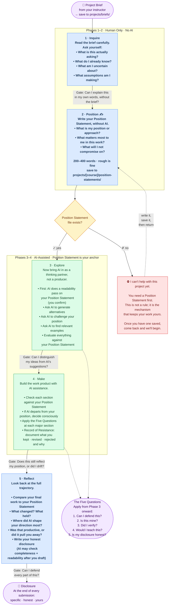

# ESF Student Workflow

The ESF Level 2 process keeps your thinking at the center of everything you produce with AI.

**The core rule:** You think first. AI assists second. Your Position Statement must exist before any AI tool opens.

---

## Your Process: Inquire → Position → Explore → Make → Reflect


```mermaid
flowchart TD
    classDef humanOnly fill:#dbeafe,stroke:#3b82f6,color:#1e3a5f,font-weight:bold
    classDef aiAssisted fill:#dcfce7,stroke:#16a34a,color:#14532d
    classDef gate fill:#fef3c7,stroke:#d97706,color:#78350f
    classDef artifact fill:#f3e8ff,stroke:#9333ea,color:#3b0764
    classDef blocked fill:#fee2e2,stroke:#dc2626,color:#7f1d1d

    BRIEF(["📄 Project Brief\nfrom your instructor\n→ save to projects/briefs/"]):::artifact

    subgraph HUMANONLY["  Phases 1–2 · Human Only · No AI  "]
        P1["1 · Inquire\nRead the brief carefully.\nAsk yourself:\n• What is this actually asking?\n• What do I already know?\n• What am I uncertain about?\n• What assumptions am I making?"]:::humanOnly

        P2["2 · Position ✍️\nWrite your Position Statement, without AI.\n• What is my position or approach?\n• What matters most to me in this work?\n• What will I not compromise on?\n\n200–400 words · rough is fine\nsave to projects/[course]/position-statements/"]:::humanOnly
    end

    GATE{"Position Statement\nfile exists?"}:::gate
    BLOCKED["⛔ I can't help with this project yet.\n\nYou need a Position Statement first.\nThis is not a rule; it is the mechanism\nthat keeps your work yours.\n\nOnce you have one saved,\ncome back and we'll begin."]:::blocked

    subgraph AIASSISTED["  Phases 3–4 · AI-Assisted · Position Statement is your anchor  "]
        P3["3 · Explore\nNow bring AI in as a thinking partner,\nnot a producer.\n\n• First: AI does a readability pass on\n  your Position Statement (you confirm)\n• Ask AI to generate alternatives\n• Ask AI to challenge your position\n• Ask AI to find relevant examples\n• Evaluate everything against\n  your Position Statement"]:::aiAssisted

        P4["4 · Make\nBuild the work product with AI assistance.\n\n• Check each section against your Position Statement\n• If AI departs from your position, decide consciously\n• Apply the Five Questions at each major section\n• Record of Resistance: document what you\n  kept · revised · rejected and why"]:::aiAssisted
    end

    P5["5 · Reflect\nLook back at the full trajectory.\n\n• Compare your final work to your Position Statement\n• What changed? What held?\n• Where did AI shape your direction most?\n• Was that productive, or did it pull you away?\n• Write your honest disclosure\n  (AI may check completeness + readability after you draft)"]:::humanOnly

    FQ(["The Five Questions\nApply from Phase 3 onward:\n1. Can I defend this?\n2. Is this mine?\n3. Did I verify?\n4. Would I teach this?\n5. Is my disclosure honest?"]):::artifact

    DISCLOSURE(["📝 Disclosure\nAt the end of every submission:\nspecific · honest · yours"]):::artifact

    BRIEF --> P1
    P1 -->|"Gate: Can I explain this\nin my own words, without the brief?"| P2
    P2 --> GATE
    GATE -->|"✓ yes"| P3
    GATE -->|"✗ no"| BLOCKED
    BLOCKED -.->|"write it,\nsave it,\nthen return"| P2
    P3 -->|"Gate: Can I distinguish\nmy ideas from AI's suggestions?"| P4
    P4 -->|"Gate: Does this still reflect\nmy position, or did I drift?"| P5
    P5 -->|"Gate: Can I defend\nevery part of this?"| DISCLOSURE
    P3 -.-> FQ
    P4 -.-> FQ
```

---

## The Position Statement

*In professional practice, this is a creative brief. Learning to write one now means you can define and defend creative direction when the audience is a client, a creative director, or a hiring committee.*

Your Position Statement is the most important thing you write before starting a project. It goes in `projects/[course]/position-statements/` before any AI tool opens.

**Three things it contains:**

| Element | Question | Example |
|---------|----------|---------|
| **Position** | What do I think, want to argue, or want to create? | *"This poster series should make climate data feel personal, not abstract."* |
| **Emphasis** | What matters most? What should I avoid? | *"Emphasize the emotional connection. De-emphasize statistics."* |
| **Non-negotiables** | What must be present, no matter what AI suggests? | *"Every piece must be reworked by hand. AI images are reference only."* |

Takes 5 to 10 minutes. Rough outlines and bullet points are fine. Those minutes are where the learning happens. AI cleans up readability at the start of Phase 3.

**For technical or creative computing projects:** Include a sketch or diagram showing how your system is intended to work: what receives input, how it processes, and what it outputs. A physical drawing, a digital wireframe, or a Mermaid diagram in your project repository all qualify. This becomes the visual anchor for your intent before you build.

---

## Records of Resistance

*In a studio, this is called design rationale: the documented reasoning behind what you kept, changed, and rejected. Employers and collaborators expect you to explain your decisions, not just show the result.*

The most revealing evidence of your thinking is not what you accepted from AI; it's what you **rejected**.

Document it in `projects/[course]/records-of-resistance/`:

```
AI suggested: [what the AI produced]
I decided: [keep / revise / reject]
Because: [your reasoning, referencing your Position Statement]
```

These are not busywork. They are proof you were directing the process, not following it.

**For code-based projects:** Annotated Git commits qualify as Records of Resistance. A commit message that describes both the action and the reasoning ("Reverted AI-generated layout; spacing conflicted with my Position Statement") documents the same editorial judgment as the format above.

---

## Multi-Session Work

Long or complex projects often span multiple AI sessions. At the start of each new session, briefly re-establish your Position Statement and the key decisions you made in the previous session. What you choose to re-establish tells you what your highest-weight decisions are: the ones only you can hold across time.

Keep a running note of what you re-introduce to AI at each session start. At the end of the project, that note is evidence of what stayed yours throughout.

---

## The Five Questions

*These are the questions every creative professional answers during review: Can you defend the work? Is it yours? Did you verify? Can you explain it? Is your documentation honest? Practicing them here builds the reflex you will rely on in professional critiques and client presentations.*

Apply these from Phase 3 onward. At major decisions. At the end of every section. Before submitting.

| # | Question | Red Flag |
|---|----------|----------|
| 1 | **Can I defend this?** | You can't explain a decision without saying "the AI suggested it" |
| 2 | **Is this mine?** | Did I direct this, or accept AI's framing? (design authority test) |
| 3 | **Did I verify?** | Sources or facts you haven't independently checked |
| 4 | **Would I teach this?** | You can't explain your process in a way that demonstrates learning |
| 5 | **Is my disclosure honest?** | Your disclosure understates AI involvement to protect your grade |

If any answer is **no**, you have three options:
1. Revise the work until the answer becomes yes
2. Do more of the work yourself
3. Disclose accurately. Honesty about a mistake is always better than concealment

---

## Engagement Levels

*Each level maps to increasing professional independence: from guided exploration to directing your own process. By Level 4, you are operating the way senior creatives work with AI in studios and agencies.*

Your process deepens across the AI curriculum.

| Course | Level | What Changes |
|--------|-------|-------------|
| AI 101 | Discovery | Instructor scaffolds gates. Learn the Inquire + Position sequence. |
| AI 180 | Guided Use | Full process within structured parameters. Position Statement required. |
| AI 201 | Independent Use | You run the process yourself. Peer-reviewed gates. |
| AI 301 | Critical Partnership | You design your own gates. Mentor others through the process. |
